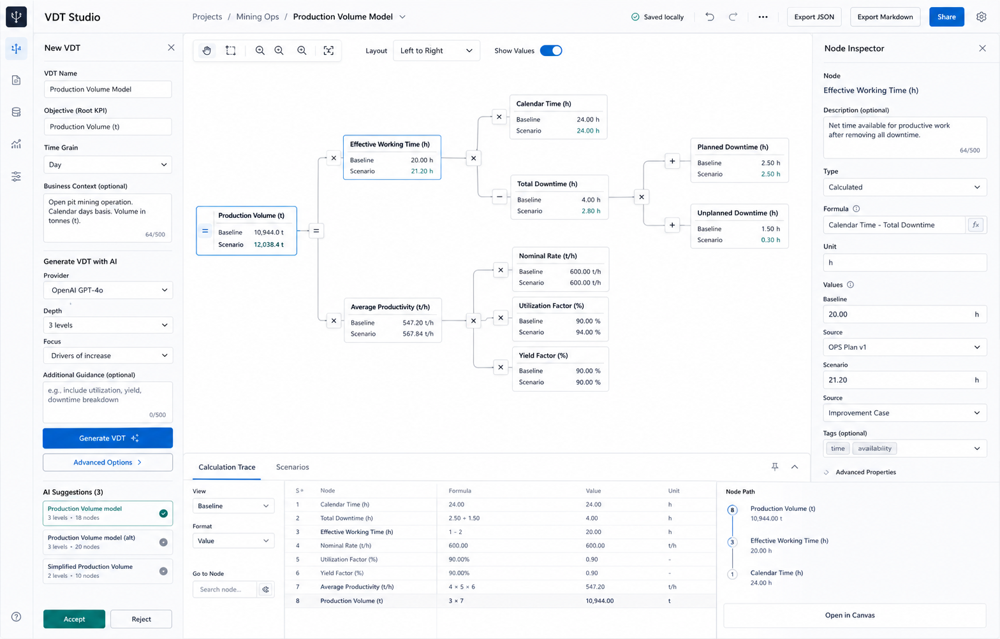

# VDT Studio

VDT Studio is an AI-first, local-first workspace for building editable Value Driver Trees and calculable KPI driver models.

The product helps analysts and consultants move from a KPI question to an explainable model: AI proposes the first draft, the user owns the logic, and a deterministic calculation engine owns the numbers.



## What It Does

- AI-generated first draft of any KPI driver tree.
- Left-to-right editable VDT canvas.
- Human review workflow for AI suggestions.
- Deterministic formula engine with trace output.
- Scenario impact analysis.
- BYOK and OpenAI-compatible model support.
- API, local-model and selected subscription backend architecture.
- Bounded model backend contract with deterministic validation.
- JSON, Markdown and SVG export.
- Browser-local JSON import.

## Quickstart

```bash
git clone https://github.com/aleksandrsafiullin/VDT-Studio.git
cd vdt-studio
pnpm install
pnpm dev
```

Optional local runner:

```bash
pnpm local-runner:start
```

## Development Commands

```bash
pnpm dev
pnpm build
pnpm typecheck
pnpm test
pnpm test:e2e
pnpm dev:all
pnpm vdt -- --help
```

## AI Model Configuration

The app ships with a deterministic mock provider for local development and tests. OpenAI-compatible endpoints are configured from `Settings -> AI`, the setup rail, or through environment variables:

```bash
OPENAI_COMPATIBLE_BASE_URL=https://api.openai.com/v1
OPENAI_COMPATIBLE_API_KEY=...
OPENAI_COMPATIBLE_MODEL=gpt-4.1-mini
```

The app keeps browser-entered API keys in memory for the active session and sends them only to the configured generation route. Secrets are not persisted in project files or browser local storage.

Local runner routing is also available from the provider selector. Start the runner, enter the short-lived terminal pairing code, select an Ollama, LM Studio, vLLM or subscription backend, then run `Test connection`:

```bash
pnpm local-runner:start
```

## Local Runner

`packages/local-runner` exposes a paired, loopback-only v1 service. The browser sends a registered backend ID and bounded task/schema input; executable names, arguments, environment and endpoints remain in reviewed server manifests. Subscription CLI manifests fail closed until separately certified. See [Local Runner](docs/LOCAL_RUNNER.md).

## Product CLI

`packages/cli` builds a narrow Node CLI for deterministic project operations and the localhost runner launcher.

```bash
pnpm vdt -- validate examples/production-volume.json
pnpm vdt -- calculate examples/production-volume.json
pnpm vdt -- export examples/production-volume.json --format markdown
pnpm vdt -- doctor
```

External agents, MCP installation, skill distribution and repository control are not product features. See [ADR-001](docs/adr/ADR-001-model-backends-not-agent-orchestration.md).

## Examples

Example projects live under `examples/`:

- `production-volume.json`
- `oee.json`
- `inventory-level.json`
- `maintenance-cost.json`

## Roadmap

- PNG canvas export.
- SQLite-backed local project storage.
- Excel calculation model export.
- PowerPoint summary export.
- PDF report generation.
- Individually certified subscription-backend adapters and desktop OS sandbox profiles.
- Tauri desktop packaging.

## Contributing

See [CONTRIBUTING.md](CONTRIBUTING.md).

## License

MIT
