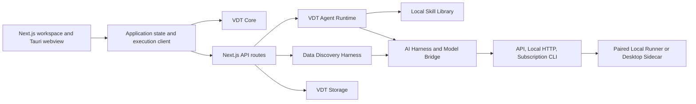

# Architecture

Last reviewed against the working tree: **2026-08-10**.

## System Context



## Design Principles

- AI proposes meaning and structure; deterministic code validates and calculates.
- The user owns approval and must see assumptions, unresolved questions and material evidence.
- Provider execution is bounded by registered tasks, schemas and reviewed manifests.
- The product's in-app VDT agent may call approved application tools; external coding agents do not control the app, repository, shell or provider settings.
- Projects, revisions, datasets and evidence require explicit ownership and immutable identities.
- Preview/sample artifacts are not calculation sources.
- Security and documentation are part of the implementation contract.

## Workspace Packages

| Package | Responsibility |
|---|---|
| `apps/web` | Next.js UI, API routes, Zustand UI/draft state and execution-client boundary |
| `apps/desktop` | Tauri shell, reviewed native commands, sidecar host and private IPC |
| `packages/vdt-core` | Graph/domain types, change sets, formula parser/evaluator, validation, scenarios, comparison and export |
| `packages/vdt-storage` | SQLite project metadata, strict atomic revision commit/recovery, production Sequence 3 migration, conversations and filesystem layout |
| `packages/vdt-agent` | Current V1 skill parsing/classification/retrieval and recipe compilation; target single-copy repository contracts |
| `packages/vdt-agent-runtime` | Run state, decision/tool loop, tool registry, feedback, research tools and mutation pipeline |
| `packages/data-harness` | Experimental file parsing, profiling, semantic inference, data-agent loop and mapping proposals |
| `packages/ai-harness` | Task prompts, schemas, provider abstraction, local validation and repair |
| `packages/model-bridge` | Backend registry, task/schema IDs, safe parsing and subscription adapter contracts |
| `packages/local-runner` | Loopback API, reviewed backend manifests, process isolation and desktop sidecar runtime |
| `packages/cli` | Deterministic validate/calculate/export commands and runner launcher |
| `packages/ui` | Shared UI primitives |

## Primary Runtime Flows

### Manual project flow

`UI edit -> local command/change set -> core validation/calculation -> save revision -> SQLite metadata + revision file`

W0.1 routes all production revision writers through one domain `commitVdtRevision()` boundary. It validates strict canonical payload bytes, reserves idempotency/attempt/head state under CAS, publishes a revision-ID path with `O_CREAT | O_EXCL` no-clobber semantics, fsyncs the file and directory, and only then commits the active head. Manual/create APIs and agent persistence use the same boundary; list/load responses expose persisted project runtime state and per-VDT heads.

The implementation still duplicates substantial draft/project state in Zustand persistence. W0.1 preserves unsaved local edits on conflict and blocks navigation after a failed auto-save, but SQLite-only durable ownership, metadata/revision atomicity and broader dirty-state reconciliation remain W0.5 work. Windows storage durability is not verified.

### Agent flow

`POST /api/agent/runs -> first response -> repeated agent_decision -> one tool -> structured feedback -> validate/calculate -> SSE snapshot/events -> user review`

The agent runtime is a real iterative loop. Tools are registered and Zod-validated, but the JSON Schema summaries shown to models omit types/required/enums for most tools. Run serialization, restart leases and complete manual-change reconciliation remain open.

The current skill path classifies requests and can select a generic fallback; `skill.read` also changes selection state. Those are V1 limitations, not the target contract.

### Corrective V2 boundary (target, default-off)

[`ADR-003`](adr/ADR-003-single-copy-skills-and-agent-owned-resolution.md) defines the frozen boundary; the exact design-only fields, canonical byte framing and state transitions are in [`CORRECTIVE_GATE_A_CONTRACT_SCHEMAS.md`](architecture/CORRECTIVE_GATE_A_CONTRACT_SCHEMAS.md).

```text
original user request
  -> agent catalog browse/discovery
  -> read exact accessible skill versions
  -> explicit skill.select under run-state CAS
  -> pinned recipe bindings
  -> one validated immutable RunBuildBasis
  -> ChangeSet / validation / approval
  -> atomic revision commit
```

Bundled skills retain one reviewed canonical source under `packages/vdt-agent/skills`; sidecar files remain generated. User skill versions are stored verbatim once and shared by ACL reference rather than content copies. Retrieval/indexing is recall-only and cannot mutate selection. There are no translated variants, language alias registries, marker-selected skills or automatic generic fallback in the V2 contract.

Repository and write commands receive a server-issued actor context. Client/model payloads cannot choose principal, tenant/workspace/project ownership or a human approval actor.

All V2 feature flags are server-owned, fail closed and default to disabled. Projects receive sticky runtime-generation/migration state before any V2 writer can be enabled. V1/V2 mixed writes and destructive down-migration are prohibited.

### Data discovery flow

`agent composer paperclip + selected KPI -> POST /api/data/files -> immutable source bytes + UI preview -> POST /api/data/discovery/runs -> full-byte parse/profile -> configured-provider semantic review -> incoming category aggregation -> materialized Baselines -> VDT change-set preview`

This is a separate experimental harness. The general flow can propose metrics; the `incoming_kpis` entry purpose prefers a reviewed taxonomy and creates filtered category nodes under the selected KPI. When the selected table is complete and a numeric measure is confirmed, deterministic harness code aggregates matching rows, converts compatible time units and writes `baselineValue` plus source-hash/row-coverage evidence into the change set. Truncated or invalid data fails closed to `unknown`. The managed local runtime and API/BYOK providers use the same bounded task schemas. The core calculator consumes the materialized value but still does not execute or refresh `dataMapping`. See `DATA_INGESTION.md`.

### Model execution flow

The browser-side `apps/web/lib/ai-execution-client.ts` selects one of:

- hosted API/BYOK route;
- development standalone runner;
- reviewed Tauri command IPC in desktop mode.

`packages/model-bridge` owns backend IDs and schema IDs. `packages/local-runner` owns executable aliases, static arguments, environment, timeouts and output caps. Browser requests cannot provide executable details.

Model discovery follows the same ownership boundary. Subscription model IDs come only from adapter-owned CLI commands. BYOK Settings sends `operation: list_models` plus the resolved session-only provider configuration to `/api/ai/generate-vdt`; the server performs the bounded provider request and returns normalized IDs. The browser never calls provider model endpoints directly, and static preset/CLI catalogs are not treated as availability evidence. Azure uses a manual deployment name because the resource model catalog is not a deployment inventory.

## Data And State Ownership

| State | Current owner | Target rule |
|---|---|---|
| UI preferences and recoverable draft | Zustand/localStorage | Remain browser-local and non-authoritative |
| Projects and VDT metadata | SQLite | Durable source of truth |
| VDT graph revisions | Strict canonical revision files + SQLite head/attempt/idempotency state | W0.1 atomic revision-CAS writes implemented; Windows durability unverified |
| Agent runs | Persisted run store + API snapshots | Per-run lease, attempt and recovery contract |
| Uploaded datasets | `.vdt/data-discovery` files/snapshots | Project-owned immutable versions with retention/encryption |
| Skills | `packages/vdt-agent/skills` for current bundled source | Single-copy repository: reviewed bundled source plus immutable verbatim user versions; ACL references; generated sidecar only |
| Provider status | `release/provider-certification.json` | Canonical release metadata |

### Sequence 3 runtime artifact policy

Production migration admission verifies the frozen V2 manifest, Sequence 3
SQL, WASM module, ABI contract, static WASM profile and closed transform
identity. It validates the golden-vector length/checksum from the trusted
manifest against compiled constants, but does not open, parse or execute the
121,310,783-byte vector registry. The 55 ABI and 204 host vectors remain
explicit offline certification evidence. Actual legacy `agent_runs` rows are
validated and transformed inside the fenced Sequence 3 transaction.

## Trust Boundaries

- Hosted web must not execute local CLIs.
- Desktop exposes only reviewed Tauri commands and private pipe messages.
- Standalone runner is loopback-only and paired.
- CLI manifests own commands/arguments/environment; provider output is untrusted.
- Web search results and uploaded file contents are untrusted data, not instructions.
- Current upload ownership, isolation and dependency vulnerabilities block production data use.

## Known Architectural Gaps

1. Concurrent agent attempts and stale snapshots can overwrite user changes; W0.2 durable coordination/merge contracts are not frozen.
2. Visual edges, formula dependencies and units are not yet one validated contract.
3. Research lacks source opening, immutable evidence and benchmark applicability.
4. Data mappings remain declarative metadata rather than reusable executable query plans; only the narrow incoming-category discovery path materializes a value during its original run.
5. Data-agent and VDT-agent orchestration are separate and inconsistent.
6. Large `vdt-store.ts` and `data-harness/src/index.ts` modules mix too many responsibilities.
7. There is no server-issued actor/tenant/workspace authorization context for the data/skill target model.
8. Sequence 3 is production-wired locally, but Windows durability, native crash evidence and package transport remain unverified release gates.
9. Real Windows Node 24 capability, concurrency and crash-recovery evidence is absent for the W0.1 durability claim.

The active remediation sequence is maintained in `VDT_STUDIO_CORRECTIVE_IMPLEMENTATION_PLAN.md`; evidence is appended to `implementation/VDT_CORRECTIVE_EXECUTION_LOG.md`. Architectural decisions are recorded under `docs/adr/`.
