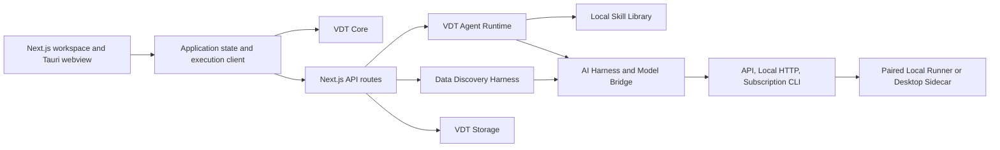

# Architecture

Last reviewed against the working tree: **2026-07-23**.

## System Context

## Design Principles

- AI proposes meaning and structure; deterministic code validates and calculates.
- The user owns approval and must see assumptions, unresolved questions and material evidence.
- Provider execution is bounded by registered tasks, schemas and reviewed manifests.
- The product's in-app VDT agent may call approved application tools; external coding agents do not control the app, repository, shell or provider settings.
- Projects, revisions, datasets and evidence require explicit ownership and immutable identities.
- Preview/sample artifacts are not calculation sources.
- Security and documentation are part of the implementation contract.

## Workspace Packages

| Package | Responsibility |
|---|---|
| `apps/web` | Next.js UI, API routes, Zustand UI/draft state and execution-client boundary |
| `apps/desktop` | Tauri shell, reviewed native commands, sidecar host and private IPC |
| `packages/vdt-core` | Graph/domain types, change sets, formula parser/evaluator, validation, scenarios, comparison and export |
| `packages/vdt-storage` | SQLite project metadata, VDT records, hashed revision files, conversations and filesystem layout |
| `packages/vdt-agent` | Skill parsing, classification/retrieval, decomposition plans and deterministic recipe compilation |
| `packages/vdt-agent-runtime` | Run state, decision/tool loop, tool registry, feedback, research tools and mutation pipeline |
| `packages/data-harness` | Experimental file parsing, profiling, semantic inference, data-agent loop and mapping proposals |
| `packages/ai-harness` | Task prompts, schemas, provider abstraction, local validation and repair |
| `packages/model-bridge` | Backend registry, task/schema IDs, safe parsing and subscription adapter contracts |
| `packages/local-runner` | Loopback API, reviewed backend manifests, process isolation and desktop sidecar runtime |
| `packages/cli` | Deterministic validate/calculate/export commands and runner launcher |
| `packages/ui` | Shared UI primitives |

## Primary Runtime Flows

### Manual project flow

`UI edit -> local command/change set -> core validation/calculation -> save revision -> SQLite metadata + revision file`

The current implementation still duplicates substantial draft/project state in Zustand persistence. SQLite is intended to be the durable source, but split-brain and stale-save risks remain. Revision files are hash-checked; atomic reservation/write is an open P0 issue.

### Agent flow

`POST /api/agent/runs -> first response -> repeated agent_decision -> one tool -> structured feedback -> validate/calculate -> SSE snapshot/events -> user review`

The agent runtime is a real iterative loop. Tools are registered and Zod-validated, but the JSON Schema summaries shown to models omit types/required/enums for most tools. Run serialization, restart leases and complete manual-change reconciliation remain open.

### Data discovery flow

`POST /api/data/files -> stored source/preview -> POST /api/data/discovery/runs -> parse/profile -> semantic model -> metric proposal -> VDT change-set preview`

This is a separate experimental harness. It can create data sources and `data_mapped` nodes, but the core calculator does not execute `dataMapping`; no baseline is materialized. See `DATA_INGESTION.md`.

### Model execution flow

The browser-side `apps/web/lib/ai-execution-client.ts` selects one of:

- hosted API/BYOK route;
- development standalone runner;
- reviewed Tauri command IPC in desktop mode.

`packages/model-bridge` owns backend IDs and schema IDs. `packages/local-runner` owns executable aliases, static arguments, environment, timeouts and output caps. Browser requests cannot provide executable details.

## Data And State Ownership

| State | Current owner | Target rule |
|---|---|---|
| UI preferences and recoverable draft | Zustand/localStorage | Remain browser-local and non-authoritative |
| Projects and VDT metadata | SQLite | Durable source of truth |
| VDT graph revisions | Hashed JSON revision files + SQLite index | Atomic, revision-CAS writes |
| Agent runs | Persisted run store + API snapshots | Per-run lease, attempt and recovery contract |
| Uploaded datasets | `.vdt/data-discovery` files/snapshots | Project-owned immutable versions with retention/encryption |
| Skills | `packages/vdt-agent/skills` | Versioned source; sidecar copy generated |
| Provider status | `release/provider-certification.json` | Canonical release metadata |

## Trust Boundaries

- Hosted web must not execute local CLIs.
- Desktop exposes only reviewed Tauri commands and private pipe messages.
- Standalone runner is loopback-only and paired.
- CLI manifests own commands/arguments/environment; provider output is untrusted.
- Web search results and uploaded file contents are untrusted data, not instructions.
- Current upload ownership, isolation and dependency vulnerabilities block production data use.

## Known Architectural Gaps

1. Revision files can be overwritten before a conflicting SQLite insert fails.
2. Concurrent agent attempts and stale snapshots can overwrite user changes.
3. Visual edges, formula dependencies and units are not yet one validated contract.
4. Research lacks source opening, immutable evidence and benchmark applicability.
5. Data mappings are declarative metadata, not executable query plans.
6. Data-agent and VDT-agent orchestration are separate and inconsistent.
7. Large `vdt-store.ts` and `data-harness/src/index.ts` modules mix too many responsibilities.

The remediation sequence is maintained in `ROADMAP.md`. Architectural decisions are recorded under `docs/adr/`.
