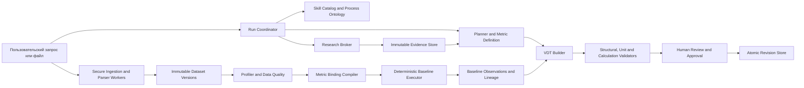

# Критическое ревью архитектуры, агентского исполнения и контура данных VDT Studio

> **Статус:** point-in-time audit и источник для roadmap. Это не living capability document; актуальные статусы поддерживаются в `PRODUCT_SPEC.md`, `PRODUCTION_READINESS.md` и `ROADMAP.md`.

> **Примечание о supersession (2026-07-23):** доказательства, воспроизведённые findings, dependency-audit snapshot и выводы ниже сохранены как point-in-time review. Целевые рекомендации в F-08 и исторической Волне 3 про RU/KZ/EN aliases, keyword/marker routing, rerank как selector или research/generic fallback заменены [`VDT_STUDIO_CORRECTIVE_IMPLEMENTATION_PLAN.md`](VDT_STUDIO_CORRECTIVE_IMPLEMENTATION_PLAN.md) и [`ADR-003`](adr/ADR-003-single-copy-skills-and-agent-owned-resolution.md). Принятый target — один канонический artifact на версию skill, agent-owned понимание исходного языка, selection-neutral `skill.read` с append-only read receipt, явный `skill.select` и явный no-applicable-skill gap. Это примечание не утверждает, что target реализован; текущий dependency-audit приведён в [`PRODUCTION_READINESS.md`](PRODUCTION_READINESS.md).

**Дата среза:** 23 июля 2026 года

**Репозиторий:** `vdt-studio`, ветка `main`

**Рассмотренный срез:** текущее рабочее дерево, включая незакоммиченный прототип `data-harness` и UI импорта данных

**Цель:** дать достаточную техническую основу для плана исправлений и последующей разработки деревьев факторов, поиска процессов и бенчмарков, а также расчёта KPI по пользовательским отчётам и выгрузкам.

---

## 1. Управленческий вывод

VDT Studio уже имеет настоящую, а не декоративную агентскую основу: модель принимает одно решение за шаг, вызывает типизированные инструменты, получает обратную связь, строит граф постепенно, а финал блокируется при невычислимом корневом KPI. Формульный движок детерминирован, есть preview изменений, локальный runtime, SQLite-хранилище, sidecar и сильная базовая тестовая дисциплина.

Однако целевые возможности из запроса пользователя **ещё не реализованы как надёжный продуктовый контракт**:

1. Приложение не гарантирует, что визуальное дерево, формулы, единицы и вычисляемые значения описывают одну и ту же модель.
2. Каталог skills узкий и почти полностью англоязычный; русскоязычный запрос на уже поддерживаемый горный процесс уходит в generic fallback.
3. Web research возвращает поисковые snippets, но не открывает и не фиксирует первоисточник, не извлекает структурированный benchmark и не связывает утверждение с доказательством.
4. Новый импорт данных создаёт `dataMapping`, но не исполняет его и не рассчитывает baseline. UI может сообщить об успешном применении change-set, после чего расчёт выдаёт `missing_value` для всех импортированных KPI.
5. Контур загрузки файлов содержит подтверждённое тихое усечение данных и несколько release-blocking рисков безопасности.
6. Сохранение ревизий неатомарно: конфликт номера способен перезаписать уже сохранённую ревизию до ошибки SQLite.

**Итоговая рекомендация:**

- **No-Go** для production, hosted-доступа, расчёта реальных KPI и заявления об аудируемых бенчмарках.
- **Conditional Go** только для контролируемого alpha-прототипирования на копиях данных без операционной ответственности.
- Следующий этап должен начинаться не с добавления PDF/OCR и новых LLM prompts, а с атомарности, единой модели метрик и происхождения данных, строгого агентского протокола и исполняемого baseline engine.

---

## 2. Карта готовности

| Область | Оценка | Состояние | Главный вывод |
|---|---:|---|---|
| Детерминированный formula engine | 3/5 | Частично готов | Безопасный AST, но слишком узкий язык и слабая размерностная проверка |
| Корректность дерева факторов | 2/5 | Блокер | Формулы и визуальные связи могут расходиться; visual cycle проходит validation |
| Agent decision/tool loop | 3/5 | Рабочий прототип | Реальный цикл есть, но нет per-run serialization, строгих schemas и recovery lease |
| Skills и process knowledge | 2/5 | Блокер целевой универсальности | Только 11 skills; RU/KZ retrieval и сертификация recipe отсутствуют |
| Web research | 2/5 | Ограниченно | Поиск есть, открытия/фиксации источника и evidence verification нет |
| Benchmark discovery | 1/5 | Не готов | Нет структурированной сущности benchmark, applicability и citation gate |
| Импорт небольших CSV/XLSX | 2/5 | Прототип | Простые fixtures разбираются, реальные отчёты и большие файлы ненадёжны |
| Расчёт KPI/baseline из данных | 1/5 | Не реализован | Mapping — метаданные, а не исполняемый query plan |
| Data quality и lineage | 1/5 | Не готов | Профиль и evidence минимальны, lineage неполон, sampling неаудируем |
| Persistence и concurrency | 1/5 | Критический блокер | Подтверждены риск повреждения ревизии и stale overwrite |
| Security загружаемых файлов | 1/5 | Release blocker | High advisories, поздние limits, plaintext, нет ownership/retention |
| Build и automated tests | 4/5 | Сильная база | Gates проходят, но критичные сценарии отсутствуют в suite |

---

## 3. Объём и метод ревью

Проверены:

- продуктовые и runtime-спецификации в `docs/`;
- `packages/vdt-core`, `vdt-agent`, `vdt-agent-runtime`, `ai-harness`, `model-bridge`, `vdt-storage`, `data-harness`;
- Next.js API, Zustand store, agent/data UI и desktop sidecar;
- полный тестовый и build-контур на штатном Node 24;
- локальные воспроизводимые проверки классификации, unit validation, data mapping, расчёта и persistence;
- production dependency audit и актуальные security advisories.

Ограничения ревью:

- credentialed Brave/Tavily и реальные AI providers не запускались;
- не было предоставлено эталонного пользовательского отчёта с известными KPI;
- packaged macOS/Windows приложение и native installer не запускались;
- `docs/PRODUCT_SPEC.md` и `docs/PRODUCTION_READINESS.md` называют `Technical Specification for Codex.docx` источником истины, но этого файла в рабочем дереве нет. Поэтому соответствие полному исходному ТЗ нельзя подтвердить независимо.

### 3.1 Выполненные проверки

| Проверка | Результат |
|---|---|
| `pnpm typecheck` на Node 24.14.0 | Pass |
| Полный `pnpm test` | 117 файлов, 967 pass, 11 live tests skipped |
| `pnpm lint` | Pass, 4 warnings |
| CLI + Next production build | Pass |
| `desktop:sidecar:verify` | Pass |
| `phase7:verify` | Pass: 18 tasks, 18 schemas, 9 manifests, 12 mock tasks |
| `docs:verify` | Pass, но не обнаруживает отсутствие заявленного DOCX source-of-truth |
| `pnpm security:audit` | **Fail: 3 high vulnerabilities** |

Security audit подтвердил:

- `xlsx@0.18.5`: high prototype pollution; npm-линейка не содержит исправленной версии — [GHSA-4r6h-8v6p-xvw6](https://github.com/advisories/GHSA-4r6h-8v6p-xvw6);
- `xlsx@0.18.5`: high ReDoS; npm-линейка не содержит исправленной версии — [GHSA-5pgg-2g8v-p4x9](https://github.com/advisories/GHSA-5pgg-2g8v-p4x9);
- `sharp@0.34.5`: high уязвимости унаследованного `libvips`, исправление начинается с `0.35.0` — [GHSA-f88m-g3jw-g9cj](https://github.com/advisories/GHSA-f88m-g3jw-g9cj).

Успешные тесты доказывают работоспособность проверяемых контрактов, но не покрывают concurrency, большие файлы, реальный baseline, multilingual retrieval, доказательный benchmark flow, restart recovery и реальные providers.

---

## 4. Текущая архитектура: что уже сделано правильно

### 4.1 Сильные стороны агентского runtime

- В `packages/vdt-agent-runtime/src/orchestrator.ts:442` реализован настоящий `decision -> one tool -> feedback -> next decision` loop, а не один большой generation prompt.
- Tool registry валидирует аргументы и output и возвращает structured envelope: `packages/vdt-agent-runtime/src/tool-registry.ts:93`.
- `researchMode=off` блокирует `research.search_web` до вызова внешнего provider: `packages/vdt-agent-runtime/src/tools/research-tools.ts:107`.
- Ошибки инструментов возвращаются модели как feedback, а graph mutation проходит validation.
- Finish gate требует валидный граф, вычислимый root и конечное число: `packages/vdt-agent-runtime/src/orchestrator.ts:766`.
- Mutation preview и approval pipeline уже дают хорошую основу для human-in-the-loop.
- Provider keys не попадают в публичный research status; cancellation передаётся через `AbortSignal`.

### 4.2 Сильные стороны core и исполнения

- Формулы разбираются собственным AST без `eval`.
- Поддерживаются ссылки по стабильным node ID, обнаружение formula cycles, деление на ноль и calculation trace.
- Core отделяет AI proposal от детерминированного вычисления.
- SQLite включает WAL, foreign keys и hash verification ревизий.
- Local runner и desktop sidecar имеют ограниченные протоколы вместо generic shell/FS доступа.
- Полный build и 967 тестов проходят на поддерживаемой Node 24.

### 4.3 Сильные стороны прототипа data discovery

- Уже введены semantic model, observations, evidence objects, data sources, taxonomy и data-mapped nodes.
- Model-facing значения частично редактируются от secrets, email, phone и spreadsheet injection.
- Имеются ограничения размера, строк, колонок и листов, пусть часть из них применяется слишком поздно.
- CSV/XLS/XLSX/JSON/NDJSON/Parquet дают полезную основу для следующего этапа.

Эти элементы стоит сохранить. Требуется не переписать всё, а объединить их строгими контрактами корректности, provenance и concurrency.

---

## 5. Критические находки

### Приоритеты

- **P0** — риск повреждения/потери данных или тихого неверного расчёта; блокирует дальнейшее доверие к продукту.
- **P0-release** — блокирует hosted/public deployment и обработку недоверенных файлов.
- **P1** — целевая возможность формально есть в UI/API, но не выполняет обещанный результат.
- **P2** — существенный риск надёжности, поддержки или масштабирования.
- **P3** — качество UX и прозрачность.

### F-01 — P0: конфликт ревизии повреждает уже сохранённую историю

**Доказательство.** `saveVdtRevision()` сначала пишет файл с именем только по `revisionNo`, а затем вставляет запись в SQLite: `packages/vdt-storage/src/sqlite.ts:234-278`. API вычисляет `max(revisionNo) + 1` вне блокировки/CAS: `apps/web/app/api/vdt/vdts/[vdtId]/revisions/route.ts:51-67`.

Воспроизведён последовательный конфликт: вторая запись revision №1 перезаписала файл, затем получила `UNIQUE constraint failed`; чтение первой записи завершилось `Revision graph hash mismatch`.

**Влияние.** Потеря единственной корректной копии модели при double-save, двух окнах, повторном запросе или параллельных actor'ах.

**Обязательное исправление.**

1. Резервировать revision number и проверять `expectedActiveRevisionId` внутри одной DB transaction.
2. Писать payload во временный уникальный файл, выполнять `fsync`, затем atomic rename только после успешного reserve/commit-протокола.
3. Не использовать один и тот же путь до подтверждения ownership ревизии.
4. Возвращать `409 REVISION_CONFLICT` без изменения старого файла.
5. Добавить parallel, retry и crash/fault-injection tests.

**Exit gate:** 100 параллельных save одного base revision создают одну принятую ревизию, остальные получают 409; все предыдущие hashes читаются после искусственного crash на каждой стадии.

### F-02 — P0: API тихо анализирует только первые 4096 байт CSV/JSON

**Доказательство.** Upload сохраняет `textPreview`, run передаёт preview вместе с полными bytes, а `textFromInput()` всегда предпочитает preview:

- `apps/web/app/api/data/files/route.ts:27`;
- `apps/web/app/api/data/discovery/runs/route.ts:48`;
- `packages/data-harness/src/index.ts:2529`.

Воспроизведение: CSV размером 14 903 байта и 1000 строк был распознан как 280 строк с `truncated=false`. Большой JSON обрывается посреди документа и может упасть как invalid JSON.

**Влияние.** Тихо неверные sums, averages, row counts и baselines без видимого предупреждения — наиболее опасный класс аналитической ошибки.

**Обязательное исправление.** Parser обязан читать полный immutable source. Preview — отдельный UI artifact и никогда не является источником расчёта. В manifest должны сохраняться `sourceByteCount`, `sourceRowCount`, `parsedRowCount`, `sampledRowCount`, `truncated`, `samplingPolicy`.

**Exit gate:** файлы 4 KB, 50 MB и >25k строк либо полностью считаются, либо явно получают blocking status `sample_only/unsupported`; ни один baseline не рассчитывается по нераскрытому sample.

### F-03 — P0: параллельный agent loop и stale snapshot могут затереть ручную работу

**Доказательство.**

- UI позволяет instruction во время `running`: `apps/web/components/vdt/setup-rail.tsx:115`;
- сервер может запустить второй `executeRun` без per-run mutex: `packages/vdt-agent-runtime/src/orchestrator.ts:125,200,442`;
- mutation pipeline хранит `baseRevision`, но не сравнивает его перед apply: `packages/vdt-agent-runtime/src/mutation-pipeline.ts:63,212`;
- runtime реально применяет только `node_updated`, а delete/edge/position/project replacement остаются сообщением: `packages/vdt-agent-runtime/src/orchestrator.ts:975`;
- клиент затем безусловно заменяет local project snapshot проекта агента: `apps/web/components/vdt/vdt-store.ts:1136`.

**Влияние.** Дублированные tool calls, stale preview, возврат удалённого узла, потеря ручного edge/formula/position, недетерминированное состояние проекта.

**Обязательное исправление.** Per-run actor/queue, один active attempt, execution lease, monotonic attempt ID, idempotency key, revision CAS и полный manual-change operation. Конфликт должен вести в `needs_merge/rebase`, а не в silent overwrite.

**Exit gate:** два одновременных instruction выполняются последовательно; manual add/delete/edge/project replacement во время tool call сохраняются либо требуют явного merge.

### F-04 — P0-release: обработка недоверенных файлов небезопасна

**Доказательство.**

- `xlsx@0.18.5` имеет две high vulnerabilities и реально читает пользовательские файлы;
- `sharp@0.34.5` имеет high inherited vulnerabilities;
- `request.formData()` и XLSX matrix материализуются до применения большинства limits: `apps/web/app/api/data/files/route.ts:10`, `packages/data-harness/src/index.ts:811`;
- исходные файлы и snapshots сохраняются plaintext без owner/project scope, retention/delete и encryption: `apps/web/app/api/data/store.ts:31`;
- GET/edit/apply авторизуются только знанием ID; при доступе вне single-user loopback это IDOR;
- XLSX archive/decompression limit, MIME magic validation, quarantine и parser isolation отсутствуют.

**Влияние.** Prototype pollution, DoS, decompression bomb, cross-project access и долговременное хранение чувствительных выгрузок.

**Обязательное исправление.** До разрешения внешних upload:

1. заменить/обновить уязвимые readers и `sharp`, зафиксировать dependency policy;
2. ввести streaming ingress limit до buffer, magic-byte validation и decompression budget;
3. выполнять parsers в изолированном worker/process с CPU/RAM/time limits;
4. обеспечить project ownership, local-only enforcement либо auth/tenant checks;
5. добавить encryption-at-rest/keychain, retention, delete/export lifecycle и egress consent;
6. логировать передачу schema/sample внешнему provider и применять DLP/redaction policy.

**Exit gate:** security audit не содержит high/critical; zip bomb, 51 MB body, crafted XLSX, cross-project ID и prompt-injection fixtures блокируются предсказуемо.

---

## 6. P1-находки: дерево факторов и агентские возможности

### F-05 — визуальный граф, formula DAG и units не являются единым контрактом

`validateGraph()` проверяет unit equality для `+/-`, но не выводит размерность для `*` и `/`: `packages/vdt-core/src/graph/validation.ts:45-98`. Он не блокирует visual cycles, неверный root type, factor edge, не используемый формулой, или формульную зависимость без соответствующего математического edge.

Воспроизводимая проверка изменила unit корня `Production Volume` с `tonnes/month` на `USD`; модель осталась `valid=true`, без warnings. Также valid проходят visual cycle и root без формулы/значения. UI при этом показывает `Model graph valid`: `apps/web/components/vdt/top-bar.tsx:143`.

**Что требуется:**

- канонический dependency DAG и отдельная tree projection;
- typed dimensions и unit algebra, включая currency/base year, percentage scale и time grain;
- явное разделение mathematical и contextual edges;
- состояния `structurally_valid`, `dimensionally_valid`, `calculation_ready`, `evidence_ready`, `approved`;
- запрет approval, если любой обязательный gate не пройден.

### F-06 — импорт создаёт mapping, но не входящий KPI и не baseline

`buildVdtChangeSet()` создаёт `data_mapped` nodes с `valueStatus: "unknown"`, без `value`/`baselineValue`: `packages/data-harness/src/index.ts:1164-1197`. Calculator для leaf node читает только `baselineValue ?? value`: `packages/vdt-core/src/formula/calculate.ts:101-127`.

Воспроизведение на CSV с Revenue/Orders:

- были предложены row count, sum и average;
- change-set успешно применился;
- каждый новый узел получил `missing_value`;
- root продолжил использовать старую формулу и старое значение;
- `applyChangeSet()` вернул `success=true`, потому что проверил только структуру.

Кроме того, все кандидаты добавляются как `positive_driver` к выбранному/root узлу, не включаются в его формулу, а multi-column metric сохраняет только `sourceColumns[0]`: `packages/data-harness/src/index.ts:1165-1191`.

**Вывод:** текущий data import — semantic suggestion prototype, а не расчёт KPI.

**Что требуется:** executable `MetricBinding/QueryPlan`, full-dataset execution, materialized `BaselineObservation`, reconciliation с target metric и preview рассчитанного результата до apply.

### F-07 — data-agent из UI фактически отключён и изолирован от основного runtime

Wizard не передаёт `providerId/config`: `apps/web/components/data-import/data-import-wizard.tsx:106`. Route создаёт provider только при наличии этих полей, а harness без provider завершает работу на эвристиках: `apps/web/app/api/data/discovery/runs/route.ts:33`, `packages/data-harness/src/index.ts:1670`.

Даже при ручной передаче provider data-agent имеет отдельный allowlist без `skill.*` и `research.*`, а prompt запрещает network: `packages/data-harness/src/index.ts:228,1857`.

**Влияние:** анализ данных не может использовать отраслевые skills, уточнять неизвестный процесс и искать справочные определения/бенчмарки. В продукте возникают два несовместимых agent runtime.

**Что требуется:** data analysis как специализированный sub-run единого orchestrator, с теми же policy, events, skills, controlled research, cancellation, resume и evidence store.

### F-08 — каталог skills не поддерживает универсальный и многоязычный запрос

Registry содержит только 11 skills: восемь mining, один finance, один SaaS и один generic (`packages/vdt-agent/skills/registry.md`). `normalizeText()` удаляет всё кроме `[a-z0-9]`: `packages/vdt-agent/src/index.ts:985-991`. Classification знает только `mining | finance | saas | generic`.

Воспроизводимая проверка:

| Запрос | Результат |
|---|---|
| «Месячный объем экскавации», «Горнодобывающая промышленность», русские факторы | `generic / logical_kpi_decomposition`, confidence 0.35 |
| То же содержание на английском | `mining / excavation`, confidence 0.95 |

Также recipe может получить `quality: complete` без формул; для `mine_production_system` warning сам указывает, что `min(...)` не поддержан.

**Что требуется:** multilingual lexical + embedding retrieval, cross-domain candidates, ontology aliases RU/KZ/EN, model rerank, использование `whenNotToUse`, versioned SkillPack и обязательная recipe certification: formula closure, units, required inputs, calculability и eval coverage.

### F-09 — tools и BYOK protocol недостаточно строго описаны модели

`listSpecs()` строит схему, где properties равны `{}` без type/required/enum/limits: `packages/vdt-agent-runtime/src/tool-registry.ts:74-82,211-219`. Проверка `research.search_web` дала:

```json
{
  "query": {},
  "purpose": {},
  "maxResults": {}
}
```

Модель видит около 50 инструментов и вынуждена угадывать аргументы. BYOK path дополнительно передаёт `z.unknown()` вместо единого strict `agent-decision-v1`; local runner поэтому надёжнее BYOK.

**Влияние:** `INVALID_TOOL_ARGS`, лишние repair iterations, стоимость и непредсказуемость providers.

**Что требуется:** full JSON Schema из Zod, contextual tool allowlist по фазе, generated valid examples и один strict decision schema для всех providers; runtime validation остаётся вторым барьером.

### F-10 — retries, restart recovery и mutation approval не соответствуют production runtime

- Любая tool error считается retryable и может повторяться до `maxSteps`; нет fingerprint/per-error budget и backoff: `packages/vdt-agent-runtime/src/feedback.ts:85`, `orchestrator.ts:573-579`.
- Persisted `running` после restart получает новый `AbortController`, но worker не re-enqueue'ится: `packages/vdt-agent-runtime/src/run-store.ts:308-327`.
- UI всегда отправляет `autoApplyPatches:true`; delete/formula/root changes существующего проекта могут пройти без risk-based approval: `apps/web/components/vdt/vdt-store.ts:2767`.

**Что требуется:** attempt lease/heartbeat, controlled `interrupted/retryable`, idempotent resume, error fingerprints, retry budgets, 429/5xx backoff+jitter и approval policy по риску изменения.

### F-11 — «subagents» являются синхронными эвристиками

`subagent.create_task` выполняет deterministic switch в том же процессе; `timeoutMs` и `retryCount` только записываются в telemetry: `packages/vdt-agent-runtime/src/tools/subagent-tools.ts:19-127`.

Это допустимо как bounded critic helpers, но название создаёт завышенное ожидание независимого planner/reviewer. Следует либо переименовать их в `review_tools`, либо реализовать настоящий bounded sub-run с отдельным контекстом, budget, timeout, artifacts и независимым verdict.

---

## 7. P1-находки: web research и бенчмарки

### F-12 — web research не формирует доказательную базу

Положительно: есть `purpose=benchmarks`, Brave/Tavily adapters, timeout, cancellation и policy gate.

Но фактический flow заканчивается поисковым snippet:

- provider interface предусматривает `open`, но tool не зарегистрирован;
- Tavily вызывается с `include_raw_content: false`;
- результат содержит только `title`, `url`, `source`, `snippet`, `retrievedAt`;
- `lastToolResult` перезаписывается следующим tool call;
- finish summary не имеет обязательного citations schema;
- `valueSource` содержит лишь tier/confidence/catalogRef/note/range: `packages/vdt-core/src/types.ts:41-49`.

Отсутствуют publisher, publication date, source snapshot, metric definition, geography, cohort, process technology, period, sample/methodology, currency/base year, license и applicability.

**Влияние:** поисковый snippet может стать числом в KPI без воспроизводимой связи с первоисточником. Это не аудируемый benchmark.

### F-13 — нет benchmark applicability и пользовательского принятия

Одинаковое название KPI не делает сравнение корректным. Бенчмарк должен быть сопоставим по:

- формуле и numerator/denominator;
- unit/scale и временной базе;
- отрасли, технологии и стадии процесса;
- географии, валюте и base year;
- размеру предприятия/cohort;
- периоду наблюдения и методологии выборки.

Текущая модель этих полей не имеет. Также нет правила: «benchmark не становится baseline без просмотра источника и подтверждения пользователя».

### F-14 — research content является prompt-injection каналом

Недоверенный snippet сериализуется в следующий model prompt как `lastToolResult`: `packages/vdt-agent-runtime/src/orchestrator.ts:610,1006`. Явной trust-boundary, source quoting policy и malicious-content tests нет.

**Что требуется для F-12–F-14:** отдельный Research Broker и immutable Evidence Store с pipeline:

`search -> open/fetch -> extract claim -> normalize -> source quality check -> corroborate -> applicability score -> user accept -> bind`.

Веб-контент должен быть помечен untrusted data, не иметь права изменять tool policy, system instructions или проект напрямую.

---

## 8. P1-находки: отчёты, выгрузки и baseline

### F-15 — реальные Excel-отчёты разбираются ненадёжно

XLSX parser предполагает «первая непустая строка = header» и «одна таблица на sheet»: `packages/data-harness/src/index.ts:782-858`. Титульная строка перед заголовками привела к потере `Tonnes` и предложению только record count.

Отсутствуют:

- обнаружение title rows, merged/multi-row headers и нескольких tables на sheet;
- hidden sheets/formula semantics и явный policy для calculated cells;
- XLSB, digital PDF, scanned PDF/OCR;
- confidence по найденной таблице и обязательный user confirmation header range.

Рекомендация: сначала довести CSV/XLSX до детерминированной корректности, затем добавлять PDF/OCR как отдельные adapters с собственными quality gates.

### F-16 — numeric, locale, time и entity semantics способны исказить baseline

`parseNumeric()` удаляет пробелы и заменяет каждую запятую точкой: `packages/data-harness/src/index.ts:2468`.

- `1,234.56` превращается в `1.234.56` и теряется;
- `12%` превращается в `12`, а не `0.12`;
- numeric ID может стать measure;
- currency не получает currency code/base year;
- `Tonnes` не получает каноническую unit;
- timezone, fiscal calendar, entity grain и canonical conversions отсутствуют;
- отсутствие числовых значений может выглядеть как ноль.

Любая из этих ошибок создаёт правдоподобный, но неверный KPI. Нужен locale-aware parser с явным пользовательским выбором при неоднозначности и typed semantic model.

### F-17 — sampling и data quality не позволяют доверять результату

Берутся первые 25 000 строк, semantic row count становится размером sample, а original count и sampling policy теряются: `packages/data-harness/src/index.ts:843,1095`.

Профиль местами сохраняет `nullCount=0`, `uniqueCount=0` и пустые examples вне зависимости от данных: `packages/data-harness/src/index.ts:1242`. Quality layer проверяет преимущественно exact duplicates и >40% nulls.

Отсутствуют key uniqueness, type validity, referential integrity, freshness, period completeness, entity/time grain, schema drift, outlier impact, join coverage и full-vs-sampled status.

### F-18 — human review не подтверждает полный смысл KPI

- Rename metric может удалить его из preview из-за lookup по старому имени: `packages/data-harness/src/index.ts:417`.
- Изменение logical role колонки не пересобирает measures/dimensions/metrics/change-set: `index.ts:471`.
- Любой save edits переводит run в `waiting_review`, даже если обязательные questions не решены: `index.ts:515`.
- UI показывает только первые 10 колонок, 6 KPI и 8 categories без полноценного «ещё N» и без контракта вопрос/ответ.
- Final change-set preview не показывает embedded mapping в node additions, period, filters, row coverage и рассчитанный baseline.

**Что должен подтверждать пользователь до apply:** source table/columns, metric definition, aggregation/ratio, filters, dimensions, entity grain, period/window/timezone, unit/currency, target VDT node, вычисленное значение, row coverage/exclusions и lineage.

### F-19 — lineage и lifecycle недостаточны

Audit не фиксирует полный набор provider/model/prompt/schema/parser versions, dataset/project revision hashes, actor, metric definition, baseline period, applied transformations и observation hashes.

Нет source refresh/version/delete, multi-file joins и staleness propagation. Повторный import может конфликтовать вместо создания новой immutable dataset version.

---

## 9. P1/P2-находки: product state, approval и документация

### F-20 — SQLite и Zustand/localStorage конкурируют как источники истины

Полный проект/runtime state сохраняется локально, а server-side SQLite имеет собственные revisions. Save metadata и revision выполняются разными запросами без expected revision; UI может выставить `lastSavedAt` после появления новых правок: `apps/web/components/vdt/vdt-store.ts:2197`.

Back является обычной ссылкой и может закрыть editor без dirty-dialog: `apps/web/components/vdt/top-bar.tsx:123`, `use-workspace-route-sync.ts:105`.

**Что требуется:** SQLite как единственный durable source of truth; localStorage только для UI preferences, identifiers и восстанавливаемого draft. Все изменения проходят единый command/change-set pipeline с base revision, inverse patch и audit.

### F-21 — статус approved не имеет quality gate

API позволяет менять status без проверки active revision, calculation, units или evidence: `apps/web/app/api/vdt/vdts/[vdtId]/route.ts:45`. Ручные patches идут напрямую в Zustand, delete не гарантирует очистку формульных ссылок, а полноценный snapshot создаётся не для каждой ручной операции.

`approved` должен быть производным от принятой immutable revision и набора gates, а не редактируемым cosmetic field.

### F-22 — крупные модули смешивают слишком много ответственности

- `apps/web/components/vdt/vdt-store.ts` — около 3800 строк: UI state, network, persistence, agent events, mutations и data import.
- `packages/data-harness/src/index.ts` — около 2800 строк: parsing, profiling, semantic inference, orchestration, editing, security redaction и change-set generation.

Это повышает риск скрытых side effects и делает невозможным изолированное property/fuzz testing. Нужна декомпозиция по контрактам, не косметическое дробление файлов.

### F-23 — документация и release gates расходятся с реализацией

- `PRODUCTION_READINESS.md` заявляет 497 tests, фактически сейчас 967 pass.
- Документ называет SQLite и data mapping future scope, хотя оба контура уже присутствуют.
- ADR утверждает, что orchestration/skills удалены из продукта, хотя они стали центральной архитектурой.
- `docs:verify` проходит при отсутствии заявленного `Technical Specification for Codex.docx`.

Требуется versioned architecture baseline, current capability matrix и docs gate, проверяющий существование/хэш источников истины.

---

## 10. Разрыв между желаемой и текущей возможностью

### 10.1 Построение дерева факторов по пользовательскому запросу

**Сейчас:** хорошо работает для узкого набора англоязычных mining/finance/SaaS templates; generic decomposition возможен, но семантическая полнота и единицы не гарантированы.

**Нужно:** распознать KPI и отрасль на языке пользователя, выбрать/скомбинировать skills, определить неизвестные части процесса, найти проверяемые источники, построить dependency model, задать минимальные вопросы, проверить размерности и получить вычислимую модель.

### 10.2 Поиск данных о процессах при нехватке skills

**Сейчас:** `research.search_web` возвращает snippets; process extraction основан на фиксированных английских терминах. Нет source open, process ontology и evidence persistence.

**Нужно:** gap detector должен сформулировать конкретный research question, искать первичные/авторитетные источники, открывать их, извлекать process stages/inputs/outputs/constraints, фиксировать claims и только затем расширять draft.

### 10.3 Поиск benchmark при отсутствии baseline

**Сейчас:** purpose есть, но benchmark entity и audit trail отсутствуют.

**Нужно:** находить range/median/percentiles вместе с определением, unit, периодом, географией, cohort и methodology; оценивать applicability; показывать пользователю источник и не принимать значение автоматически.

### 10.4 Анализ отчётов и выгрузок

**Сейчас:** создаются semantic candidates и metadata mappings; значения не вычисляются, реальные отчётные layouts и sampling ненадёжны.

**Нужно:** получить immutable dataset, обнаружить таблицы/grain/keys, определить metric query, рассчитать число на полном наборе локальным engine, показать reconciliation и сохранить полный lineage.

---

## 11. Целевая архитектура



### 11.1 Основные архитектурные принципы

1. **LLM предлагает смысл, deterministic engines владеют числами и валидацией.**
2. **Один agent runtime.** Factor building, research и data analysis — специализированные run phases/sub-runs, а не отдельные несовместимые orchestration stacks.
3. **Один durable source of truth.** Каждый actor изменяет проект через versioned commands с CAS.
4. **Источник, утверждение и значение разделены.** Наличие URL не равно доказательству; доказательство не равно применимому benchmark; benchmark не равен принятому baseline.
5. **Preview/sample никогда не является скрытым источником расчёта.**
6. **Approval относится к immutable revision и evidence chain.**

### 11.2 Каноническая модель метрики

```text
MetricDefinition
  id, semanticKey, name, direction
  formulaAst / numerator / denominator
  unitDimension, displayUnit, scale
  aggregation, entityGrain, timeGrain, timeWindow, timezone
  filters, dimensions, owner, version

BaselineObservation
  metricDefinitionId
  value or range, unit, period/asOf
  sourceType: calculated | user | benchmark | assumption
  datasetExecutionId or benchmarkObservationId
  confidence, status, acceptedBy, acceptedAt
```

Baseline precedence должен быть явным:

1. рассчитанный actual из подтверждённых данных;
2. введённое пользователем значение;
3. принятый benchmark с applicability/evidence;
4. явное assumption/default.

Источники нельзя бесшумно смешивать или заменять.

### 11.3 Evidence и benchmark model

```text
EvidenceRecord
  url, title, publisher
  publishedAt, retrievedAt
  immutableContentHash / snapshotRef
  excerptLocation, license, sourceTier, qualityScore

BenchmarkObservation
  metricDefinitionId
  value, range, percentile, unit
  period, geography, industry, technology, cohort, sampleSize
  methodology, currency, baseYear
  evidenceIds, corroborationStatus, applicabilityScore
  acceptedBy, acceptedAt
```

`finish` не должен разрешать benchmark-backed baseline, если отсутствуют opened source, claim-to-source link, unit/period и user acceptance.

### 11.4 Исполняемый data binding

Свободной строки `transform` недостаточно. Нужен versioned typed plan:

```text
MetricBinding
  datasetVersionId, tableIds
  joins and keys
  measure / numerator / denominator
  aggregation, filters, dimensions
  entityGrain, timeColumn, timeWindow, timezone
  null/duplicate/outlier policy
  unit and currency conversion
  targetMetricDefinitionId

MetricExecution
  bindingVersion, engineVersion
  sourceHash, inputRows, includedRows, excludedRows
  resultValue, resultUnit
  warnings, reconciliation, traceHash
```

LLM формирует предложение binding; локальный analytical engine компилирует и исполняет его. Результат становится baseline только после deterministic validation и user review.

### 11.5 Дерево факторов как представление dependency DAG

Рекомендуемый контракт:

- `MetricDefinition` и mathematical dependency образуют канонический DAG;
- пользовательский canvas показывает tree projection слева направо;
- повторно используемый фактор отображается как reference/alias, а не создаёт расходящиеся копии метрики;
- contextual edges визуально отличаются и не участвуют в формуле;
- formula references и mathematical edges обязаны быть взаимно согласованы;
- unit engine выводит dimension каждого AST node и блокирует несовместимый результат.

---

## 12. Целевой agent flow

1. **Understand.** Определить root KPI, язык, отрасль, цель, период, unit и known inputs.
2. **Retrieve.** Выполнить multilingual hybrid retrieval skills и process ontology.
3. **Gap detection.** Явно перечислить неизвестные process components, metric definitions и baselines.
4. **Research, если разрешено.** Искать только конкретные gaps; открывать источники; сохранять evidence.
5. **Plan.** Сформировать decomposition plan и вопросы с максимальным information gain.
6. **Build.** Добавлять один проверяемый слой, формулы и assumptions.
7. **Validate.** Structural, dimensional, calculation, evidence и policy checks.
8. **Critic.** Независимый bounded review проверяет полноту, double counting, units, causal direction и evidence.
9. **Human review.** Показать skills, sources, assumptions, unresolved gaps и impact diff.
10. **Commit.** Сохранить immutable revision через CAS и atomic storage.

Run Coordinator должен иметь:

- queue/lease/heartbeat/attempt ID;
- max steps, token/cost/time/research budgets;
- per-error fingerprint/retry budget;
- contextual tool allowlist;
- idempotency keys и deterministic replay metadata;
- restart state `interrupted`, а не zombie `running`;
- risk-based approvals;
- policy для outbound data и web content trust boundary.

---

## 13. Целевой data flow

1. **Upload/quarantine:** verify size before buffer, magic bytes, file type, malware/policy checks.
2. **Immutable DatasetVersion:** content hash, owner/project, parser version, source byte/row count.
3. **Parser adapter:** CSV, XLSX, JSON, Parquet; отдельный adapter и quality contract для каждого формата.
4. **Table discovery:** header range, tables, keys, grain, types, formulas, sheet visibility.
5. **Profile and DQ:** completeness, uniqueness, validity, freshness, referential integrity, drift, outliers.
6. **Semantic proposal:** dimensions, measures, entities, time axes и candidate MetricDefinitions.
7. **Mandatory questions:** ambiguities по locale, unit, currency, period, grain, filters и target KPI.
8. **Binding compile:** typed MetricBinding -> executable plan.
9. **Full-data execution:** локальный columnar/SQL engine; sample используется только для preview.
10. **Reconciliation:** row coverage, exclusions, source totals, unit conversion и known control totals.
11. **Review:** показать exact definition, result, trace, confidence и warnings.
12. **Apply:** ChangeSet с base revision, MetricDefinition, Binding и BaselineObservation.
13. **Refresh:** новая DatasetVersion пересчитывает binding и помечает dependent baseline stale до approval.

Сначала следует сертифицировать CSV и XLSX. PDF/OCR добавлять только после того, как baseline из structured data воспроизводимо совпадает с эталонным SQL.

---

## 14. Приоритетная дорожная карта

### Волна 0 — сохранить данные и остановить тихие ошибки

**Зависимости:** нет. **Приоритет:** P0.

Deliverables:

- atomic revision writer + DB CAS + 409 conflicts;
- per-run coordinator и manual-change merge contract;
- исправление 4096-byte source/preview defect;
- запрет calculated claim при `sample_only`;
- устранение high dependencies;
- local-only enforcement либо auth/tenant boundary;
- parser isolation, resource limits, retention/delete.

Exit gate: P0 concurrency, crash, large-file и security tests проходят; старые revisions не повреждаются.

### Волна 1 — единое ядро корректности KPI

**Зависимости:** Волна 0. **Приоритет:** P1.

Deliverables:

- versioned `MetricDefinition`;
- typed units/dimensional algebra;
- alignment visual edges <-> formula references;
- states structural/dimensional/calculation/evidence/approved;
- единый command/change-set pipeline для user/agent/import;
- SQLite source-of-truth и dirty-state UX.

Exit gate: неверные units, visual cycles, orphan formula refs и root без значения блокируют approval.

### Волна 2 — доказательный research и benchmark registry

**Зависимости:** MetricDefinition и Evidence Store из Волны 1. **Приоритет:** P1.

Deliverables:

- research `search/open/extract/verify` tools;
- immutable EvidenceRecord/source snapshots;
- BenchmarkObservation + applicability model;
- source ranking и primary-source preference;
- corroboration и citation gate;
- outbound privacy consent и egress audit;
- evidence UI.

Exit gate: benchmark нельзя принять без opened source, definition, unit, period, cohort/geography и user confirmation.

### Волна 3 — масштабируемые skills и надёжный agent runtime

**Зависимости:** Волны 1–2. **Приоритет:** P1.

Deliverables:

- SkillPack schema/versioning/evals;
- RU/KZ/EN aliases и hybrid retrieval;
- process ontology и model rerank;
- recipe certification;
- full JSON Schema для tools и единый strict provider protocol;
- retry budgets, restart recovery, risk-based approval;
- компактный UI «skills / sources / assumptions».

Exit gate: multilingual golden corpus выбирает корректный skill/process либо доказательно запускает research fallback.

### Волна 4 — data-to-KPI MVP для CSV/XLSX

**Зависимости:** Волна 1, частично Волна 3. **Приоритет:** P1.

Deliverables:

- secure adapters и immutable DatasetVersion;
- real row counts и sample/full distinction;
- locale-aware number/date/unit parsing;
- table/header/grain/key discovery;
- DQ engine;
- MetricBinding DSL/compiler;
- deterministic full-data baseline executor;
- target KPI mapping и reconciliation UI;
- refresh/version/staleness/lineage.

Exit gate: golden CSV/XLSX fixtures дают тот же baseline, что эталонный SQL, с полным trace и повторяемым hash.

### Волна 5 — реальные отчёты и connectors

**Зависимости:** сертифицированная Волна 4. **Приоритет:** P2.

Порядок:

1. сложные XLSX и multi-table sheets;
2. XLSB, если это реальный пользовательский формат;
3. digital PDF tables;
4. OCR/scanned PDF с confidence и обязательной сверкой;
5. database/API connectors и scheduled refresh;
6. multi-file joins и semantic mapping reuse.

Каждый adapter получает собственный conformance corpus и unsupported contract.

### Волна 6 — production hardening и quality program

**Зависимости:** все предыдущие. **Приоритет:** P1/P2.

Deliverables:

- live-provider certification RU/EN;
- performance/cost/latency SLO;
- security threat model и external review;
- backup/restore/migration tests;
- audit export и data deletion proof;
- provider, parser, skill и schema version observability;
- docs/spec governance и release readiness matrix.

---

## 15. План-ready backlog

| Epic | Результат | Priority | Зависит от | Основной acceptance |
|---|---|---:|---|---|
| E0 Atomic revisions | Невозможность overwrite существующей ревизии | P0 | — | CAS, 409, crash safety, parallel test |
| E1 Run coordinator | Один attempt и merge manual edits | P0 | E0 | no lost update, lease/recovery |
| E2 Secure ingestion | Безопасный immutable source | P0-release | — | no high audit, streaming limits, ownership |
| E3 Metric kernel | Canonical metric/unit/dependency model | P1 | E0 | dimensional and calculation gates |
| E4 Evidence layer | Claim-to-source provenance | P1 | E3 | immutable source + citation validation |
| E5 Benchmark flow | Применимый и принятый benchmark | P1 | E4 | structured fields + user acceptance |
| E6 Skill platform | Multilingual, versioned, certified skills | P1 | E3/E4 | RU/KZ/EN retrieval and recipe evals |
| E7 Strict agent protocol | Full tool/provider schemas и budgets | P1 | E1 | generated examples, retry/restart tests |
| E8 Dataset platform | Versions, parsing, DQ, lineage | P1 | E2 | full-vs-sample proof, DQ gates |
| E9 Baseline executor | Исполняемый MetricBinding | P1 | E3/E8 | exact golden result and trace |
| E10 Review UX | Полное human confirmation | P1 | E5/E9 | source/definition/value/impact preview |
| E11 Report adapters | XLSX complex, PDF/OCR, connectors | P2 | E8/E9 | adapter-specific conformance corpus |
| E12 Quality/governance | Production evidence и docs truth | P1/P2 | все | live certification, threat model, release matrix |

---

## 16. Обязательные acceptance suites

### 16.1 Factor-tree correctness

- visual cycle, formula cycle, orphan edge и hidden formula dependency;
- wrong root type, root without value/formula, disconnected branch;
- `hours * USD/hour -> tonnes` обязан fail;
- property/fuzz tests для formula AST и dimensional algebra;
- reused factor как alias/reference без double counting;
- `approved` невозможен без всех gates.

### 16.2 Agent and skills

- RU/KZ/EN corpus по mining, finance, SaaS и нескольким новым доменам;
- ambiguous/negative examples и cross-domain retrieval;
- recipe без formula closure не может быть `complete`;
- каждый tool имеет полный JSON Schema и valid generated example;
- два simultaneous instruction дают один serialized attempt;
- repeating tool error завершается по budget;
- restart переводит run в controlled interrupted/resume;
- destructive existing-project change требует approval.

### 16.3 Research and benchmarks

- search/open/extract/corroborate на нескольких source tiers;
- malicious snippet не изменяет policy/tool choice;
- URL, publisher, date, cohort, geography, period, formula и unit обязательны;
- benchmark с несовместимой definition получает low applicability/block;
- без citation/evidence baseline нельзя принять;
- source update не переписывает старый immutable snapshot.

### 16.4 Data and baseline

- CSV >4 KB, >25k строк и контрольная сумма по полному dataset;
- `1,234.56`, `1 234,56`, percentages, currency, BOM/UTF-16, quoted multiline;
- title rows, merged/multi-row headers, several tables/sheets, formulas/hidden sheets;
- numeric ID не становится measure;
- ratio/filter KPI сохраняет numerator/denominator, filters и grain;
- empty/all-null aggregate не превращается молча в zero;
- rename/role edit пересобирает dependents;
- unresolved mandatory question блокирует apply;
- refresh создаёт новую dataset version и stale dependents;
- результат совпадает с эталонным SQL и содержит row coverage/lineage.

### 16.5 Persistence and security

- concurrent revision save, retry, crash between DB/file stages;
- edit -> Back -> reopen; two windows; save during new edit;
- cross-project ID access, missing auth/local-only mode;
- 51 MB body, zip bomb, crafted XLSX, MIME spoofing;
- PII/secret/formula/prompt-injection redaction;
- delete/retention/export proof;
- production dependency audit без high/critical.

---

## 17. Метрики качества продукта

Для каждого release candidate рекомендуется публиковать:

- skill selection recall@k и domain classification accuracy по языкам;
- formula validity и dimensional correctness;
- tree completeness, duplicate/double-count rate;
- tool first-call validity и average repair iterations;
- benchmark citation coverage и applicability acceptance rate;
- data mapping exactness, DQ defect recall и baseline error;
- percent calculations from full data vs sample-only;
- median/p95 run latency, model calls, tokens/cost и external searches;
- revision conflict rate, recovery success и lost-update count;
- source freshness, stale bindings и evidence completeness;
- user questions per accepted tree и manual correction rate.

---

## 18. Решения, которые нужно зафиксировать до разработки

| Решение | Рекомендуемый default | Почему важно |
|---|---|---|
| Deployment mode | Local-only до завершения auth/tenant/security | Меняет threat model upload/API |
| «Дерево» или DAG | Canonical metric DAG + tree projection | Позволяет reuse без double counting |
| Unit standard | Typed internal dimensions с совместимостью UCUM | Нужен проверяемый algebra contract |
| Baseline precedence | calculated > user > accepted benchmark > assumption | Исключает скрытую замену источника |
| Data engine | Локальный columnar/SQL executor | Полный dataset и reproducible plan |
| Первая data scope | CSV + XLSX | Даёт корректный фундамент до PDF/OCR |
| Research sources | Primary/authoritative first, tiered fallback | Снижает риск snippet-based claims |
| Web/data egress | Explicit consent + logged minimized payload | Защищает чувствительные выгрузки |
| Approval policy | Risk-based, strict для existing model | Не даёт агенту разрушить ручную модель |
| Source of truth | SQLite revisions; localStorage только UI/draft | Устраняет split brain |

---

## 19. Что нельзя делать на следующем этапе

- Нельзя включать hosted/public file upload до устранения F-04.
- Нельзя называть `dataMapping` рассчитанным KPI, пока отсутствует executable plan и materialized baseline.
- Нельзя автоматически записывать поисковый snippet как benchmark value.
- Нельзя добавлять PDF/OCR раньше, чем CSV/XLSX проходят full-data golden tests.
- Нельзя расширять prompts вместо исправления schemas, run coordination и validators.
- Нельзя оставлять второй data-agent runtime изолированным от skills/research/evidence.
- Нельзя скрывать sampling/truncation, unresolved questions и excluded rows.
- Нельзя присваивать `approved` mutable-проекту без immutable revision и quality gates.

---

## 20. Финальный вердикт

VDT Studio имеет сильную инженерную основу alpha-уровня и уже содержит правильные архитектурные идеи: bounded tools, deterministic calculation, human preview, local runtime и проверяемые artifacts. Поэтому проект не требует полного переписывания.

Главная проблема — разрыв между **наличием интерфейса/метаданных** и **истинностью результата**. Сегодня приложение может показать дерево, источник, mapping или status `success`, не доказав, что:

- дерево математически и размерностно корректно;
- skill соответствует языку и процессу пользователя;
- benchmark прочитан из применимого первоисточника;
- импортированный KPI действительно рассчитан по полным данным;
- revision не была затёрта конкурирующим actor'ом.

План разработки должен закрывать этот разрыв в порядке: **сохранность -> математическая корректность -> provenance -> agent reliability -> executable data baselines -> новые форматы и connectors**. После прохождения предложенных exit gates приложение сможет обоснованно претендовать на целевой сценарий: построение деревьев факторов, доказательный поиск процессов/бенчмарков и расчёт входящих KPI из пользовательских данных.
