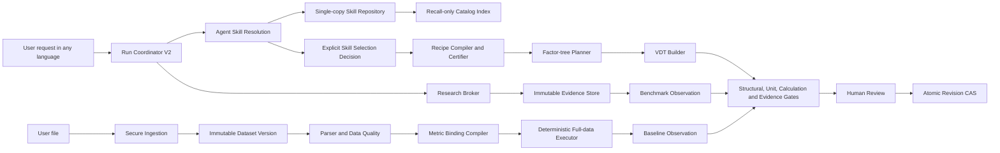

# VDT Studio — план корректирующей разработки для следующего оркестратора

**Статус документа:** approved direction; ready to start Gate A

**Статус реализации:** not started

**Версия:** 1.0

**Дата:** 2026-07-23

**Исполнитель:** следующий implementation orchestrator

**Основание:** `CRITICAL_ARCHITECTURE_AND_AGENT_REVIEW_2026-07-23.md`, текущие executable contracts и уточнение владельца продукта по архитектуре skills.

---

## 1. Назначение документа

Этот файл — исполнимый program plan. Следующий оркестратор должен использовать его как порядок разработки, проверки и handoff, а не пытаться исправить весь репозиторий одним большим изменением.

План закрывает следующие конечные возможности:

1. безопасное сохранение проектов и отсутствие lost updates;
2. математически, размерностно и структурно корректные деревья факторов;
3. выбор skills агентом для запроса пользователя на любом языке;
4. одна каноническая копия каждого skill без языковых дублей;
5. доказательный поиск процессов и benchmark-значений;
6. расчёт KPI/baseline из пользовательских отчётов и выгрузок;
7. полная lineage, human approval и production-grade security boundary.

План не является утверждением, что перечисленные возможности уже реализованы. Текущие capability statuses остаются в `PRODUCT_SPEC.md` и `PRODUCTION_READINESS.md`.

---

## 2. Приоритет документов и отменённые рекомендации

Следующий оркестратор обязан начать с `AGENTS.md` и `docs/README.md`.

Для текущей программы действует следующий порядок:

1. прямое решение владельца продукта, зафиксированное в разделе 3 этого плана;
2. `AGENTS.md`;
3. executable code, schemas, tests и generated manifests;
4. текущие operational docs;
5. target specifications;
6. point-in-time critical review.

### 2.1 Что этот план прямо отменяет

Решение владельца продукта отменяет прежние рекомендации о:

- `RU/KZ/EN lexical aliases` для выбора skills;
- переводных копиях одного skill;
- language-specific registry entries;
- keyword/regex/domain-marker routing как источнике решения;
- ASCII normalization как пути к multilingual support;
- автоматическом generic fallback;
- автоматическом выборе skill результатом retrieval score.

Следующие текущие документы должны быть приведены в соответствие во время Gate A:

- `docs/ROADMAP.md`, Wave 3;
- `docs/PRODUCT_SPEC.md`, Skills and process discovery;
- `docs/PRODUCTION_READINESS.md`, skill-selection blocker;
- `docs/AGENTIC_VDT_RUNTIME_SPEC.md`;
- `docs/VDT_Agent_Harness_TZ.md`;
- `docs/VDT_AgentDecision_ToolLoop_TZ.md`;
- `docs/AI_HARNESS.md`;
- `docs/CRITICAL_ARCHITECTURE_AND_AGENT_REVIEW_2026-07-23.md` — только пометка о superseded recommendation, без переписывания point-in-time findings.

---

## 3. Неподвижный архитектурный контракт skills

Этот раздел нельзя ослаблять в ходе реализации без нового решения владельца продукта.

### 3.1 Хранение

1. Один `skillId + version` соответствует одному каноническому source artifact.
2. Bundled skills по умолчанию создаются и поддерживаются на английском языке.
3. Пользовательский skill хранится дословно на выбранном пользователем языке.
4. Пользовательский skill может быть на любом языке и в смешанной письменности.
5. Переведённые копии, localized variants и language alias registries не создаются.
6. `contentLanguage` — metadata для отображения и аудита, но не routing filter.
7. Обновление skill создаёт новую immutable version; активный run остаётся pinned на прочитанный `versionId + contentHash`.
8. Bundled skills read-only. Пользователь может fork их, но fork получает новый user-owned ID и остаётся одной самостоятельной копией.
9. Публикация новой версии, deprecation или обычный disable не инвалидируют version, уже pinned активным run.
10. Referenced version нельзя hard-delete: используется tombstone и retention. Только security revocation может остановить active run и потребовать повторный selection.

### 3.2 Понимание запроса и выбор

1. Исходный запрос пользователя передаётся агенту без ASCII normalization и keyword pre-classification.
2. Агент понимает смысл запроса на языке пользователя.
3. Агент сам формулирует намерение поиска по каталогу.
4. Агент сам решает, какие candidate skills прочитать.
5. Агент сравнивает applicability, exclusions, required inputs, outputs, recipe quality и gaps.
6. Только явное агентское действие `skill.select` изменяет `selectedSkills`; оно атомарно заменяет полный selection set и сохраняет историю предыдущего решения.
7. `skill.read` всегда read-only и не означает выбор.
8. Retrieval/index никогда не объявляет skill выбранным и не меняет run state.
9. Generic skill выбирается только явным решением агента после чтения; автоматического fallback нет.
10. При отсутствии подходящего skill агент фиксирует `no_applicable_skill`, формулирует knowledge gaps и выбирает `research`, `ask_user` или `build_from_user_spec`.
11. Ответ пользователю формируется на языке пользователя независимо от языка выбранного skill.

### 3.3 Что допустимо для масштабирования каталога

Для текущего небольшого каталога агент должен получать все компактные `SkillCard` и самостоятельно выбирать, что читать.

Для большого каталога допустим rebuildable multilingual semantic index, но только как recall infrastructure:

- query формулирует агент;
- ACL применяется до retrieval;
- index возвращает окно кандидатов и pagination;
- similarity score не становится selection confidence;
- retrieval не пишет `selectedSkills`;
- финальное решение принимает агент после `skill.read`;
- при недоступном index агент использует paged catalog browsing, а не keyword matcher;
- внешний embedding service не получает private/workspace skills без explicit consent;
- предпочтительный desktop path — локальный index.

Consent внешнего index охватывает отдельно skill/card content, пользовательский query и business context. Withdrawal/delete должны удалять remote derived data с purge evidence; private skills всегда имеют гарантированный local/paged fallback.

Индекс содержит только canonical source-derived cards/chunks и vectors. Generated translations, language aliases и translated summaries запрещены.

Начальные operational budgets, которые затем можно ужесточить по eval evidence:

- direct catalog cards: не более 200 доступных skills и 64 KiB serialized context;
- один discovery window: до 20 candidates;
- не более 4 discovery iterations и 12 full reads на один resolution attempt;
- Skill Resolution использует не более 20% run token budget;
- превышение budget ведёт к `ask_user`/`no_applicable_skill`, а не к marker fallback;
- stale index возвращает explicit status; selection всегда revalidates canonical version/hash;
- p95 latency, tokens и cost измеряются отдельно для catalog retrieval и agent selection.

При каталоге, который не помещается в контекст, допускается bounded `Skill Librarian` sub-run. Это агентская semantic task с теми же schemas, audit и policy, а не deterministic marker classifier.

### 3.4 Сохранение нового skill из исследования

Research knowledge может использоваться в текущем run как evidence-backed guidance. Оно не становится постоянным skill автоматически.

Сохранение разрешено только отдельным пользовательским действием:

1. агент предлагает draft;
2. показывает sources, assumptions, recipe и tests;
3. пользователь выбирает язык и scope;
4. validator проверяет структуру и permissions;
5. пользователь публикует version;
6. только published/active version попадает в catalog index.

Для agent-generated drafts язык по умолчанию — английский, если пользователь не выбрал другой.

---

## 4. Final Goal

Программа завершена только когда пользователь может:

1. сформулировать KPI и business context на любом языке;
2. получить от агента обоснованный выбор одного или нескольких канонических skills независимо от языка этих skills;
3. увидеть использованные skill versions, причины выбора и uncovered gaps;
4. получить корректное дерево факторов с согласованными formulas, edges и units;
5. разрешить агенту найти недостающие части процесса в проверяемых источниках;
6. получить benchmark с definition, unit, period, geography, cohort, methodology, evidence и applicability;
7. принять либо отклонить benchmark до его превращения в baseline;
8. загрузить CSV/XLSX, подтвердить MetricBinding и получить deterministic baseline по полным данным;
9. проследить baseline до dataset version, query plan, included/excluded rows и evidence;
10. сохранить результат как atomic immutable revision без потери ручных изменений.

Production claim дополнительно требует security, provider, browser, native и release gates из Wave 7.

---

## 5. Запрещённые решения

Следующий оркестратор не должен:

- создавать multilingual variants одного skill;
- добавлять language-specific matching terms;
- использовать `DOMAIN_TERMS`, regex, keyword score или alphabet normalization для окончательного выбора skill;
- считать embedding rank решением агента;
- выбирать skill при `skill.read`;
- автоматически подставлять generic skill;
- исправлять correctness только дополнительным prompt text;
- давать модели прямое право писать project state вне ChangeSet/CAS;
- позволять skill расширять tool permissions, research policy или approval policy;
- превращать search snippet в EvidenceRecord без открытия источника;
- превращать benchmark в baseline без applicability и immutable human acceptance decision;
- показывать metadata-only mapping как calculated KPI;
- рассчитывать baseline по скрытому sample;
- добавлять PDF/OCR до сертификации CSV/XLSX;
- выполнять destructive down-migration;
- разрешать mixed writes runtime v1 и v2 в один project;
- включать hosted/public upload до security gates;
- называть deterministic helper независимым агентом.

---

## 6. Целевая архитектура



### 6.1 Agent Skill Resolution flow

```text
understand request in original language
  -> skill.catalog_overview
  -> skill.discover or paged catalog cards
  -> skill.read candidate A..N
  -> agent compares fit, exclusions and gaps
     -> skill.select
     -> skill.report_gap -> research or user.ask
     -> user.ask when ambiguity is material
  -> skill.compile_recipe for selected pinned versions
  -> validate recipe closure
  -> plan and build
```

### 6.2 Предлагаемые skill tools

#### `skill.catalog_overview`

Возвращает count, scopes, origins, catalog/index versions и index status. Не выбирает кандидата.

#### `skill.catalog_page`

Side-effect-free stable pagination для small/degraded catalog browsing:

```ts
interface SkillCatalogPageInput {
  cursor?: string;
  limit?: number;
  scopes?: Array<"bundled" | "private" | "workspace">;
  catalogVersion?: string;
}

interface SkillCatalogPageOutput {
  catalogVersion: string;
  cards: SkillCard[];
  nextCursor?: string;
}
```

Порядок стабильный и не является relevance ranking.

#### `skill.discover`

```ts
interface SkillDiscoverInput {
  intent: string;
  context?: string;
  limit?: number;
  cursor?: string;
  excludeSkillIds?: string[];
  scopes?: Array<"bundled" | "private" | "workspace">;
}

interface SkillDiscoverOutput {
  queryId: string;
  catalogVersion: string;
  indexVersion?: string;
  candidates: SkillCard[];
  nextCursor?: string;
  indexStatus: "ready" | "stale" | "unavailable";
}
```

Output не содержит `selected`, `matchedTerms` или authoritative classification.

```ts
interface SkillCard {
  skillId: string;
  versionId: string;
  contentHash: string;
  title: string;
  description: string;
  applicability: string;
  exclusions: string;
  requiredInputs: string[];
  expectedOutputs: string[];
  contentLanguage?: string;
  origin: "bundled" | "user";
  visibility: "bundled" | "private" | "workspace";
  trustLevel: "bundled_reviewed" | "workspace_reviewed" | "user_unreviewed";
  recipeStatus: "valid" | "partial" | "invalid" | "missing";
}
```

Все поля card выводятся из canonical SkillVersion/recipe. Card не хранит перевод текста skill.

#### `skill.read`

Читает конкретный `versionId` в режимах `outline | chunk | recipe | references`. Не зависит от языка Markdown headings и не изменяет run state.

#### `skill.select`

```ts
interface SkillSelectInput {
  selections: Array<{
    skillId: string;
    versionId: string;
    role: "primary" | "supporting";
  }>;
  consideredSkillIds: string[];
  rationale: string;
  uncoveredNeeds: string[];
  confidence: "high" | "medium" | "low";
}
```

Validator требует, чтобы каждая selected version была прочитана и доступна этому actor в данном run, hash совпадал с прочитанным, version не была security-revoked и selection не превышал composition limit. Обычная публикация новой active version не ломает уже pinned run.

#### `skill.report_gap`

Фиксирует отсутствие достаточного skill и выбирает следующий шаг: `research | ask_user | build_from_user_spec`.

#### `skill.compile_recipe`

Принимает только selected version. `complete` разрешён лишь при formula closure, valid units, required inputs, executable coverage и пройденном validator version. Успешная компиляция атомарно создаёт immutable `RunRecipeBinding`; build tools читают только pinned binding, а не заново компилируют current active skill.

### 6.3 Skill storage model

```ts
interface SkillRecord {
  id: string;
  origin: "bundled" | "user";
  tenantId?: string;
  workspaceId?: string;
  ownerId?: string;
  visibility: "bundled" | "private" | "workspace";
  activeVersionId?: string;
  status: "draft" | "active" | "deprecated" | "disabled";
  aclVersion: number;
}

interface SkillGrant {
  skillId: string;
  principalType: "user" | "workspace_role";
  principalId: string;
  permissions: Array<
    | "read"
    | "edit_draft"
    | "publish"
    | "share"
    | "deprecate"
    | "security_revoke"
    | "delete_tombstone"
    | "reindex"
  >;
}

interface SkillVersion {
  versionId: string;
  skillId: string;
  contentLanguage?: string;
  title: string;
  description: string;
  applicability: string;
  exclusions: string;
  bodyMarkdown: string;
  contentHash: string;
  schemaVersion: number;
  status: "draft" | "published" | "deprecated" | "revoked" | "tombstoned";
  supersedesVersionId?: string;
  derivedFromSkillId?: string;
  revokedAt?: string;
  revocationReason?: string;
  createdAt: string;
}

interface SkillRecipeArtifact {
  artifactVersion: string;
  versionId: string;
  recipe: RecipeASTV1;
  contentHash: string;
  validationStatus: "valid" | "partial" | "invalid";
  validatorVersion: string;
  createdAt: string;
}

interface RecipeASTV1 {
  schemaVersion: "recipe_ast.v1";
  rootMetric: MetricDefinitionDraftV1;
  drivers: DriverSpecV1[];
  formulas: FormulaTemplateSpecV1[];
  requiredInputs: RequiredInputSpecV1[];
}

interface DriverSpecV1 {
  driverKey: string;
  parentDriverKey?: string;
  label: string;
  metric: MetricDefinitionDraftV1;
  edgeKind: "mathematical" | "contextual";
  evidenceRequirement: "required" | "recommended" | "none";
}

interface FormulaTemplateSpecV1 {
  targetDriverKey: string;
  expression: FormulaASTV1;
  referencedDriverKeys: string[];
  expectedDimension: string;
}

interface RunRecipeBinding {
  bindingId: string;
  runId: string;
  selectionDecisionId: string;
  skillVersionId: string;
  skillContentHash: string;
  artifactVersion: string;
  artifactContentHash: string;
  recipeSchemaVersion: "recipe_ast.v1";
  validatorVersion: string;
  validationStatus: "valid" | "partial";
  boundAt: string;
}

interface SkillSelectionDecision {
  decisionId: string;
  runId: string;
  sequence: number;
  createdAt: string;
  supersedesDecisionId?: string;
  catalogVersion: string;
  catalogSnapshotHash: string;
  queryIds: string[];
  indexVersions: string[];
  orderedCandidateVersionIds: string[];
  readVersionIds: string[];
  selected: Array<{
    versionId: string;
    contentHash: string;
    role: "primary" | "supporting";
  }>;
  rationale: string;
  confidence: "high" | "medium" | "low";
  uncoveredNeeds: string[];
  backendId: string;
  modelId?: string;
  promptVersion: string;
}

interface RunBuildBasis {
  basisId: string;
  runId: string;
  sequence: number;
  source:
    | { kind: "skills"; selectionDecisionId: string; orderedBindingIds: string[] }
    | { kind: "research"; guidanceArtifactId: string; guidanceContentHash: string }
    | { kind: "user_spec"; userSpecificationArtifactId: string; specificationContentHash: string };
  orderedArtifactHashes: string[];
  composedRecipe: RecipeASTV1;
  composedRecipeHash: string;
  compositionReportHash: string;
  validatorVersion: string;
  validationStatus: "valid" | "partial" | "invalid";
  basisContentHash: string;
  status: "active" | "superseded";
  supersedesBasisId?: string;
  createdAt: string;
}

interface BuildBasisAcceptanceDecision {
  decisionId: string;
  basisId: string;
  basisContentHash: string;
  actorId: string;
  decision: "accepted" | "rejected";
  acceptedLimitations: string[];
  createdAt: string;
}

interface SkillIndexDocument {
  skillId: string;
  versionId: string;
  contentHash: string;
  canonicalCard: SkillCard;
  canonicalChunks: Array<{ chunkId: string; text: string; sourceOffset: string }>;
  vectorRefs?: string[];
  indexedAt: string;
}
```

`MetricDefinitionDraftV1`, `FormulaASTV1` и `RequiredInputSpecV1` являются versioned strict schemas из Wave 1A, генерируют JSON Schema из того же source и не могут быть `unknown`/free-form JSON. `skill.select` append-only сохраняет `SkillSelectionDecision` и под CAS run-state атомарно меняет active decision pointer. Replay обязан использовать точные `RunRecipeBinding`; новая skill/recipe/validator version не меняет уже pinned run.

Перед открытием build tools Recipe Composer создаёт единственный active `RunBuildBasis`. Для multi-skill selection он детерминированно проверяет cross-recipe IDs, duplicate/contradictory drivers, formula closure, dimensions, required inputs, provenance и ordering. Individually valid recipes не считаются совместно valid без этого composition gate. `basisContentHash` канонически покрывает source reference, ordered artifact hashes, composed recipe/hash, composition report, validator version и validation status. `partial` basis и любой `user_spec` basis требуют отдельный authenticated-human `BuildBasisAcceptanceDecision`; модель не может создать его. Acceptance и каждое build action передают `basisId + basisContentHash`. Reselection, recompile или изменение guidance atomically supersedes прежний basis, а in-flight build с прежним hash отклоняется.

`SkillIndexDocument` хранится отдельно, выводится из canonical source и может быть полностью перестроен. Это не перевод и не дополнительная skill version. Удаление/tombstone обязано удалять derived index records; для внешнего index требуется purge proof.

Authorization matrix должна отдельно определять права `read`, `create`, `edit draft`, `publish`, `share`, `deprecate`, `security revoke`, `delete/tombstone` и `reindex`. Проверка `workspaceId/tenantId` выполняется на repository boundary, а не только в UI.

---

## 7. Модель работы следующего оркестратора

### 7.1 Главная ответственность

Root orchestrator отвечает за:

- порядок waves и dependency gates;
- защиту текущего dirty worktree;
- непротиворечивость schemas, code, tests, generated artifacts и docs;
- распределение файлов между исполнителями;
- итоговый implementation-vs-plan review;
- запрет перехода дальше при незакрытом blocker.

### 7.2 Обязательные роли на каждой wave

1. **Planner**
   - читает актуальный code и normative specs;
   - фиксирует invariants, scope/out-of-scope, file ownership, migrations, rollback и test matrix;
   - отдельно перечисляет pre-existing changes.

2. **Pre-code reviewer**
   - проверяет architecture, concurrency, trust boundaries, backward compatibility и data loss risks;
   - выдаёт `GO`, `GO_WITH_FINDINGS` либо `STOP`;
   - не редактирует код slice.

3. **Coder**
   - реализует только утверждённый work package;
   - не выполняет monolithic rewrite;
   - добавляет schemas, migrations, tests и docs вместе с изменением.

4. **Code reviewer**
   - ищет correctness/security regressions и scope creep;
   - проверяет, что happy path не скрывает unsupported state.

5. **Tester**
   - независимо запускает positive, negative, adversarial, restart, concurrency и migration scenarios;
   - отделяет deterministic tests от credentialed live-provider evidence.

6. **Readiness reviewer**
   - сравнивает результат с wave brief;
   - проверяет docs truth и generated artifacts;
   - разрешает или запрещает следующую wave.

Один исполнитель не должен быть единственным автором, reviewer и приемщиком одного risk-critical slice.

### 7.3 Work package loop

Каждый package проходит:

1. repository reconnaissance;
2. baseline reproduction/test;
3. written slice brief;
4. pre-code review;
5. narrow implementation;
6. focused tests;
7. independent code review;
8. negative/adversarial tests;
9. relevant workspace gates;
10. documentation impact check;
11. evidence entry в execution log;
12. `GO/STOP` решение.

---

## 8. Gate A — preflight и contract freeze

**Цель:** создать безопасную точку старта, не меняя runtime behavior.

### A.1 Worktree inventory

- [ ] Записать `git status --short`, current branch, HEAD и diff stat.
- [ ] Назначить owner каждому pre-existing modified/untracked path.
- [ ] Отдельно определить статус текущих data-harness и documentation changes.
- [ ] Не выполнять reset, checkout, broad cleanup или `git add -A`.
- [ ] При пересечении planned slice с существующим diff выполнить STOP и разделить ownership.

### A.2 Architecture decisions

- [ ] Добавить ADR `Single-copy skills and agent-owned skill resolution`.
- [ ] Зафиксировать skill scopes, versioning, trust levels и ownership.
- [ ] Зафиксировать additive schema migration и mixed-write prohibition.
- [ ] Зафиксировать deployment default: local-only до security gates.
- [ ] Зафиксировать feature flags и kill switches.

### A.3 Documentation reconciliation

- [ ] Удалить рекомендации language aliases из current roadmap/specs.
- [ ] Обновить skill tool contracts в normative specs.
- [ ] Пометить старый classifier contract legacy/superseded.
- [ ] Добавить этот plan в current program map `docs/README.md`.
- [ ] В секции Current Work Program файла `docs/AGENT_PLANS.md` сослаться на этот plan как active execution brief, не меняя исторический статус самого `AGENT_PLANS.md`.
- [ ] Согласовать root `README.md` и `docs/ARCHITECTURE.md` с новым runtime boundary и single-copy skill contract.
- [ ] Не менять capability status до реального прохождения tests.

### A.4 Baseline evidence

- [ ] Зафиксировать текущие воспроизведения F-01, F-02, F-03, F-05, F-06 и language-selection defect как regression tests.
- [ ] Запустить focused suites, typecheck, root tests и docs gate на поддерживаемом Node 24.
- [ ] Создать `docs/implementation/VDT_CORRECTIVE_EXECUTION_LOG.md`.

### A.5 Feature flags

Минимальный набор:

- `orchestrator_v2`;
- `agent_skill_resolution_v2`;
- `metric_model_v2`;
- `evidence_v2`;
- `benchmark_v2`;
- `metric_binding_v2`;
- `data_ingestion_v2`;
- `external_research`;
- `autonomous_mutations`.

### Gate A exit

- ADR и schemas reviewed;
- pre-existing changes не потеряны;
- старый runtime не изменён;
- план и docs не содержат language-copy/marker-selection target;
- regression tests воспроизводят исходные blockers;
- reviewer status: `GO`.

---

## 9. Wave 0 — safety foundation

**Priority:** P0/P0-release

**Depends on:** Gate A

**Новый orchestrator:** только shadow/read-only до закрытия Wave 0.

### W0.1 Atomic revisions

Поверхности:

- `packages/vdt-storage/src/sqlite.ts`;
- `apps/web/app/api/vdt/vdts/[vdtId]/revisions/route.ts`;
- `apps/web/app/api/vdt/projects/[projectId]/vdts/route.ts`;
- `apps/web/app/api/agent/runs/persistence.ts`;
- `apps/web/lib/vdt-storage-client.ts`;
- все production callers `saveVdtRevision`, найденные repository-wide audit;
- storage/API tests.

Tasks:

- [ ] создать один domain-level `commitVdtRevision()` как единственную разрешённую production write boundary; routes, manual save и agent apply вызывают её, а прямой `saveVdtRevision()` остаётся internal storage primitive;
- [ ] резервировать `pending` revision ID/sequence внутри SQLite transaction с CAS по `expectedActiveRevisionId + baseHash`;
- [ ] добавить `expectedActiveRevisionId`/base hash CAS;
- [ ] писать unique temp file, fsync и публиковать immutable unique final path, включающий `revisionId`, через no-clobber operation; имя только по `revisionNo` запрещено;
- [ ] после publish сверять final payload hash с reserved hash и только затем атомарно переводить revision в `committed` и обновлять active pointer;
- [ ] возвращать `409 REVISION_CONFLICT` без изменения existing file;
- [ ] добавить idempotency key;
- [ ] добавить crash points, recovery для `pending` rows/orphan temp/final files и quarantine при hash mismatch.

Gate:

- 100 concurrent saves одного base дают одну accepted revision и 99 conflicts;
- два независимых API/runtime writer path проходят через один commit contract;
- loser никогда не изменяет bytes/hash winner final file, включая гонку между reserve и publish;
- предыдущие hashes читаются после fault injection на каждой стадии;
- retry с одним idempotency key не создаёт дубль.

### W0.2 Per-run coordinator и manual merge

Поверхности:

- `packages/vdt-agent-runtime/src/orchestrator.ts`;
- `run-store.ts`;
- `mutation-pipeline.ts`;
- `apps/web/app/api/agent/runs/**`;
- `apps/web/components/vdt/vdt-store.ts`.

Tasks:

- [ ] один active attempt на run обеспечивается SQLite-backed lease/attempt table, а не process-local `Map`/singleton;
- [ ] queue, attempt ID, lease generation/owner/expiry, transactional acquire/renew/release, heartbeat и cancellation;
- [ ] in-memory mutex разрешён только как optimization поверх durable lease;
- [ ] restart -> `interrupted/retryable`, не zombie `running`;
- [ ] operation-level manual changes для add/update/delete/edge/position/project replace;
- [ ] revision CAS перед apply;
- [ ] explicit merge/rebase state;
- [ ] per-error fingerprints, retry budgets и 429/5xx backoff.

Gate:

- simultaneous instructions сериализуются;
- два отдельных worker process/database connection не могут одновременно владеть одним run lease; stale owner с прежним generation не может commit после takeover;
- manual changes во время tool call не теряются;
- crash/restart не повторяет mutation;
- provider failure не меняет accepted revision.

### W0.3 Full-source data correctness

Поверхности:

- `apps/web/app/api/data/files/route.ts`;
- `apps/web/app/api/data/discovery/runs/route.ts`;
- `packages/data-harness` parser boundary.

Tasks:

- [ ] parser читает immutable full source;
- [ ] preview становится UI-only artifact;
- [ ] сохранить source/full/sample/truncated counts;
- [ ] запретить baseline/calculated status при unknown full coverage;
- [ ] добавить deterministic file manifest.

Gate: 1000-row/>4 KB fixture показывает 1000 source rows либо явный blocking sampled state; `truncated=false` не может быть ложным.

### W0.4 Upload security

Поверхности:

- `apps/web/app/api/data/store.ts`;
- `apps/web/app/api/data/files/route.ts`;
- `apps/web/app/api/data/discovery/runs/route.ts`;
- все `apps/web/app/api/data/discovery/runs/[runId]/**`;
- data-harness persistence и model-facing export boundary.

Tasks:

- [ ] устранить high/critical production dependencies;
- [ ] streaming limit до body materialization;
- [ ] MIME/magic-byte validation;
- [ ] archive/decompression/CPU/RAM/time budgets;
- [ ] isolated parser worker/process;
- [ ] при upload/create привязать каждый dataset version и discovery run к immutable `principalId + projectId`;
- [ ] owner/project ACL проверяется внутри data store/service на каждом create/read/list/edit/user-input/apply/delete/export, а route-level check служит дополнительной защитой;
- [ ] IDs, list/count/error responses не раскрывают cross-project/cross-principal metadata;
- [ ] retention/delete/export lifecycle;
- [ ] encryption/local permission policy;
- [ ] consent и egress audit для model-facing data;
- [ ] local-only enforcement либо полноценный auth/tenant boundary.

Gate:

- dependency audit без high/critical;
- crafted XLSX, zip bomb, 51 MB body, MIME spoof и cross-project ID блокируются;
- все data routes и direct store calls проходят positive/negative ACL matrix; dataset/run невозможно перепривязать к другому principal/project;
- hosted upload остаётся disabled до reviewer sign-off.

### W0.5 Durable state ownership

- [ ] SQLite revisions — единственный durable project source;
- [ ] project хранит sticky `runtimeGeneration: v1 | v2` и `migrationState: unmigrated | shadow | pending_v2 | v2_active | rollback_readonly`;
- [ ] каждая write command передаёт `expectedRuntimeGeneration`; storage boundary возвращает `409 RUNTIME_GENERATION_MISMATCH` до любой записи при несовпадении;
- [ ] localStorage — только UI preferences и recoverable draft references;
- [ ] save metadata + revision atomic at application contract level;
- [ ] dirty navigation guard;
- [ ] no false `lastSavedAt` при concurrent edit.

### Wave 0 exit

Все P0 tests зелёные; shadow runtime может безопасно читать и моделировать изменения, но write rollout остаётся выключенным до Wave 2.

---

## 10. Wave 1A — canonical metric and factor-tree core

**Priority:** P1

**Depends on:** Wave 0

**Можно выполнять параллельно с:** Wave 1B только для непересекающихся code/docs slices. Все persistent-schema migrations выполняются последовательно одним migration owner.

### W1A.1 Versioned domain contracts

Добавить:

- `MetricDefinition`;
- versioned shared `MetricDefinitionDraftV1`, `FormulaASTV1`, `RequiredInputSpecV1` и strict `RecipeASTV1` schemas для skill/research build artifacts;
- `BaselineObservation`;
- typed unit/dimension model;
- dependency edge kind;
- validation/approval states;
- schema/engine versions.

`MetricDefinition` должен включать formula AST/ratio, aggregation, direction, unit dimension, scale, currency/base year, entity/time grain, time window, timezone, filters и version.

### W1A.2 Dimensional algebra

- [ ] unit registry и canonical conversions;
- [ ] `+/-/*//` dimension derivation;
- [ ] percentage fraction/display scale;
- [ ] time grain compatibility;
- [ ] currency/base-year explicit source;
- [ ] unknown unit blocking/clarification policy.

### W1A.3 Formula/edge reconciliation

- [ ] canonical mathematical dependency DAG;
- [ ] tree projection и reused-factor reference semantics;
- [ ] contextual edges исключены из calculation;
- [ ] formula refs и mathematical edges взаимно согласованы;
- [ ] visual cycles/hidden dependencies/double counting blocked.

### W1A.4 Quality states

Разделить:

- `structurally_valid`;
- `dimensionally_valid`;
- `calculation_ready`;
- `evidence_ready`;
- `approved`.

`approved` относится к immutable revision и не редактируется как cosmetic field.

### W1A.5 Unified command pipeline

User, agent и import mutations проходят один ChangeSet contract с:

- base revision/hash;
- actor/correlation/attempt IDs;
- validation result;
- inverse operation;
- audit event;
- risk level и approval requirement.

### W1A.6 Migration

- v1 revision остаётся immutable;
- dry-run migration создаёт новую v2 child revision;
- если current active v1 revision была `approved`, до создания child для неё создаётся immutable approval record с `approvalBasis: legacy`;
- v2 child никогда не наследует approval и требует обычных V2 quality gates/human approval;
- active pointer остаётся на v1 до отдельной validated promotion command; command требует `expectedActiveRevisionId` и проверяет `child.parentRevisionId === current activeRevisionId`, иначе возвращает conflict и требует повторной migration/rebase; promotion на v2 явно меняет derived top-level status на unapproved до нового approval;
- old `valueSource` не становится verified evidence;
- old `dataMapping` -> `legacy_unexecutable`;
- migration idempotent, backed up и produces loss report;
- mixed v1/v2 writes запрещены.

Current mutable `VdtRecord.status=approved` мигрируется ровно в approval record исходной active v1 revision, не созданной v2 child. Top-level status становится derived/read model от active revision. Прямой PATCH/UI writer для `approved` удаляется или отклоняется; новое approval возможно только командой с expected active revision и quality-gate evidence.

### Wave 1A exit

- wrong units, visual cycle, hidden dependency и root без finite value блокируют approval;
- migrated project сохраняет исходную revision и получает auditable v2 child;
- migration test доказывает: legacy approval остаётся на v1, v2 child unapproved, active pointer не меняется без promotion, а promotion не копирует approval;
- interleaving test создаёт новую v1 revision между child creation и promotion: stale child не активируется и требует rebase/remigration;
- property/fuzz tests проходят;
- no destructive down-migration.

---

## 11. Wave 1B — versioned single-copy Skill Repository

**Priority:** P1

**Depends on:** Wave 0

**Можно выполнять параллельно с:** Wave 1A только вне `packages/vdt-storage` migration contract. Один migration owner сериализует metric/skill tables, schema version и rollback fixtures.

### W1B.1 Repository abstraction

Создать injected `SkillRepository`, объединяющий:

- bundled read-only filesystem skills;
- private user skills;
- workspace-shared skills;
- ACL-aware version lookup;
- catalog version и rebuildable index metadata.

### W1B.2 Bundled migration

- [ ] импортировать текущие 11 bundled skills без перевода;
- [ ] отметить `contentLanguage: en` по фактическому content;
- [ ] назначить stable version IDs и hashes;
- [ ] сохранить canonical skill IDs;
- [ ] не создавать language variants;
- [ ] сохранить generated sidecar как build artifact, не второй source of truth.

### W1B.3 User skill lifecycle

Добавить API/storage/UI для:

- create/import draft;
- validate;
- preview;
- publish active version;
- version history;
- private/workspace visibility;
- disable/deprecate;
- delete/retention;
- index/reindex status.

Default scope — private. Workspace sharing требует explicit action.

Publish flow включает agent-assisted semantic duplicate review:

- exact same content hash блокируется как duplicate version;
- вероятный semantic/translation duplicate показывается пользователю вместе с existing skill/version;
- пользователь выбирает update existing, fork/derive или подтверждает действительно distinct scope;
- решение и lineage сохраняются;
- similarity не блокирует publish автоматически и не используется для runtime routing.

### W1B.4 Trust and permissions

- bundled, workspace и imported/user skills имеют разные trust levels;
- skill content не изменяет system policy;
- no built-in ID/name shadowing;
- declarative recipes only;
- no executable code, shell, arbitrary FS/network permissions;
- size/reference/path limits;
- prompt-injection and permission-escalation tests.

Authorization tests покрывают каждое действие matrix для private/workspace/bundled scopes, cross-workspace IDOR и отсутствие metadata leakage.

Referenced versions сохраняются immutable. Hard delete заменяется tombstone; security revocation отдельна от deprecation/disable и обязана остановить затронутые active runs с понятным recovery path.

### W1B.5 Recipe artifacts

- hardcoded recipes переносятся в versioned recipe artifacts;
- publish-time compiler может быть model-assisted;
- deterministic validator решает `valid | partial | invalid`;
- runtime не извлекает критичный recipe из language-specific headings;
- guidance-only skill разрешён, но не получает `complete`.

### Основные code surfaces

- новые `packages/vdt-agent/src/catalog/**`;
- новые `packages/vdt-agent/src/repository/**`;
- `packages/vdt-agent/src/skill-recipe.ts`;
- `packages/vdt-storage` schema/migrations;
- новые `apps/web/app/api/skills/**`;
- новые `apps/web/components/skills/**`;
- desktop sidecar packager/loader.

### Wave 1B exit

- bundled English skill и Unicode user skill сохраняются после restart;
- в catalog ровно один source artifact на active skill version;
- user skill на любом языке доступен по ACL;
- workspace grants и tenant/workspace isolation проверены на repository/API boundaries;
- read-only bundled asset нельзя перезаписать;
- active run продолжает читать pinned deprecated/superseded version; security-revoked version переводит run в controlled reselection;
- sidecar verify проходит;
- no translation/alias artifacts generated.

---

## 12. Wave 2 — Orchestrator V2 и agent-owned skill resolution

**Priority:** P1

**Depends on:** Waves 0, 1A, 1B

**Rollout:** replay -> shadow -> internal opt-in -> project canary -> staged default.

### W2.1 State machine

Новые/уточнённые phases:

```text
understanding_request
discovering_skills
reading_skills
selecting_skills
compiling_recipes
resolving_knowledge_gaps
waiting_user_input
planning_decomposition
building_graph
validating_graph
critic_review
waiting_user_review
committing_revision
reporting
```

Build tools недоступны до создания одного active immutable `RunBuildBasis`. Его source может быть только одним из трёх проверенных оснований:

1. `skill.select` + все pinned recipe bindings + прошедшая общий composition validator композиция;
2. validated `RunGuidanceArtifact`, собранный после evidence-backed research;
3. versioned `build_from_user_spec` artifact с подтверждёнными user inputs и assumptions.

Сам по себе `skill.report_gap` build tools не открывает. `partial` или `user_spec` basis дополнительно требует matching human `BuildBasisAcceptanceDecision`; каждое build-tool действие передаёт `basisId + basisContentHash`.

`ask_user` создаёт versioned `UserInputRequestArtifact` и переводит run в отдельный durable `waiting_user_input`, не в approval-state `waiting_user_review`:

```ts
interface UserInputRequestArtifact {
  requestId: string;
  runId: string;
  sequence: number;
  questions: Array<{ questionId: string; prompt: string; expectedSchema: StrictInputSchemaV1 }>;
  missingInputKeys: string[];
  originatingPhase: string;
  runStateVersion: number;
  contentHash: string;
  status: "open" | "answered" | "cancelled" | "superseded";
  createdAt: string;
}
```

`StrictInputSchemaV1` генерируется из versioned validator contract, запрещает unspecified properties и задаёт explicit type/enum/range/format. Ответ принимается отдельной command с `requestId + contentHash + idempotencyKey`, валидируется по expected schemas и возобновляет сохранённый continuation ровно один раз. Restart сохраняет open request; cancel закрывает его; stale/superseded answer не может изменить run.

### W2.2 Удалить legacy selection из live path

В `packages/vdt-agent/src/index.ts` вывести из primary runtime:

- `DOMAIN_TERMS`;
- `VdtClassification` с fixed domain enum;
- `classifyVdtRequest()`;
- `retrieveSkills()`;
- `skillMatchesClassificationPattern()`;
- `inferPattern()`;
- `normalizeText()`/`includesTerm()`;
- authoritative use `matchingTerms`/`kpiPatterns`;
- automatic generic fallback;
- `prepareAgenticVdtRun()` как selector.

Legacy functions могут существовать временно для read-only migration/replay, но production path и new tests не должны быть способны их вызвать.

### W2.3 Новые tools

- [ ] `skill.catalog_overview`;
- [ ] `skill.catalog_page`;
- [ ] `skill.discover`;
- [ ] side-effect-free `skill.read`;
- [ ] explicit `skill.select`;
- [ ] `skill.report_gap`;
- [ ] selected-version-only `skill.compile_recipe`.

Только `skill.select` обновляет selection state. `skill.read` должен потерять текущий side effect записи в `selectedSkills`.

### W2.4 Strict schemas

- [ ] полный JSON Schema из Zod для каждого tool;
- [ ] required/type/enum/limits/examples;
- [ ] contextual allowlist по phase;
- [ ] один strict `agent-decision-v2` для BYOK и local runner;
- [ ] schema version в events/replay;
- [ ] `zodSchemaSummary()` не используется как production schema.

### W2.5 Selection audit

Сохранять:

- protected reference на original user request;
- redacted intent summary и request hash в audit;
- query attempts;
- catalog version/snapshot hash, query IDs и index versions;
- ordered candidate/read version IDs;
- selected IDs, versions, hashes и roles;
- agent rationale, confidence и uncovered gaps;
- backend/model/prompt/schema versions;
- no-match reason;
- research/user-question transition.

Original payload хранится в защищённом run store с ACL и retention policy. Обычный audit/event stream не содержит raw PII/secrets. Replay использует authorized payload reference и hashes, а export применяет redaction policy.

UI всегда показывает компактные блоки `Skills`, `Why`, `Sources`, `Assumptions`, `Unresolved gaps`; технические tool details остаются свёрнутыми.

### W2.6 Legacy caller migration

Проверить и мигрировать:

- `/api/agent/runs` bootstrap;
- `ai-harness/generate-vdt`;
- `local-runner` task paths;
- deepen-node flows;
- mock provider fixtures;
- sidecar resources;
- `model-bridge` schemas;
- tests, которые вызывают `prepareAgenticVdtRun()`.

Также обязательны:

- `packages/vdt-agent-runtime/src/types.ts` и selected-skill snapshots;
- `run-store.ts` serialization/hydration и SQLite run persistence;
- `domain-policies/mining.ts`;
- `tools/mining-validation.ts`;
- `apps/web/lib/ai-execution-client.ts`;
- local-runner summaries/audit;
- activity/setup UI и provider persistence tests;
- hydration старых run snapshots как read-only legacy records без synthetic version/hash.

### W2.7 Language-agnostic eval corpus

Нельзя создавать aliases внутри skills для прохождения этих tests.

Обязательные cases:

- один English bundled skill для эквивалентных RU, KZ, EN, Spanish, Turkish, Arabic, Chinese запросов;
- English request выбирает semantically best user skill на русском/испанском;
- mixed-language request;
- одинаковые слова, но разные business semantics;
- ambiguous multi-skill composition;
- none-of-the-above;
- adversarial title/description;
- imported skill с prompt-injection попыткой;
- skill version updated during active run;
- index unavailable degraded mode;
- catalog 10,000 skills.
- repeated runs на stochastic providers;
- skill security-revoked между read/select и после select;
- stale index/catalog mutation race;
- ACL metadata leakage;
- near-duplicate/translation poisoning;
- private-skill query/context egress consent и withdrawal;
- external index deletion/purge proof;
- p95 latency, tokens и cost на large catalog.

### W2.8 Quality gates

- 100% `read-before-select`;
- 100% version-pinned replay;
- 100% build runs pin exact skill hash, recipe artifact/hash/schema и validator version; replay не перекомпилирует current version;
- 0 implicit selections;
- 0 automatic generic selections;
- 0 live routing dependencies от markers/ASCII normalization/language aliases;
- 100% canonical cross-language fixtures;
- не менее 95% correct selection **или корректного abstention** на golden corpus каждого сертифицируемого model/backend;
- language gap к English baseline не более 5 percentage points;
- при semantic index: candidate recall@20 не менее 98%;
- tool first-call validity не менее 95%;
- 100% selection traces содержат version/hash/rationale/gaps.
- precision и correct-abstention считаются раздельно;
- multi-run stability публикуется для каждого stochastic provider/model;
- p95 latency/token/cost укладываются в утверждённый run budget;
- 0 cross-scope metadata leaks;
- 100% external-index deletions имеют purge evidence и local fallback.

### Wave 2 exit

`agent_skill_resolution_v2` проходит shadow evaluation. Default-on запрещён до реального provider certification; deterministic mock доказывает schemas/state, но не semantic multilingual quality.

---

## 13. Wave 3 — evidence, process research и benchmarks

**Priority:** P1

**Depends on:** Waves 1A and 2.

### W3.1 Evidence Store

`EvidenceRecord` включает:

- URL/source ID;
- title/publisher;
- published/retrieved dates;
- immutable content hash/snapshot ref;
- exact excerpt location;
- source tier/quality;
- license/retention;
- claim links.

### W3.2 Research Broker

Реализовать:

`search -> open/fetch -> extract -> normalize -> verify -> corroborate`.

Search snippet — только locator. Он не является evidence и не передаётся как instruction.

### W3.3 Process gap resolution

После `skill.report_gap` агент:

1. формулирует конкретные missing process questions;
2. ищет authoritative/primary sources;
3. открывает источники;
4. извлекает stages, inputs, outputs, constraints и formulas;
5. создаёт run-scoped evidence-backed guidance;
6. просит missing user inputs;
7. не сохраняет постоянный skill автоматически.

```ts
interface RunGuidanceArtifact {
  artifactVersion: string;
  id: string;
  runId: string;
  knowledgeGapIds: string[];
  evidenceIds: string[];
  claims: Array<{ claimId: string; text: string; evidenceIds: string[] }>;
  recipe: RecipeASTV1;
  assumptions: string[];
  contentHash: string;
  validatorVersion: string;
  validationStatus: "valid" | "partial" | "invalid";
}
```

Только `valid` artifact либо user-approved `partial` artifact с explicit unresolved limitations может открыть planning/building. Разрешение build pinning'ует `artifactVersion + contentHash + validatorVersion + recipe.schemaVersion`; повторная генерация при replay запрещена. Artifact не становится persistent skill без отдельного publish flow.

### W3.4 BenchmarkObservation

Обязательные поля:

- `metricDefinitionId`;
- value/range/percentile;
- unit/scale/currency/base year;
- period/asOf;
- geography;
- industry/technology/cohort;
- sample size/methodology;
- evidence IDs;
- corroboration status;
- applicability score/reasons.

Принятие не является mutable полем observation и не входит в model-generated research tool payload:

```ts
interface BenchmarkDecisionContext {
  decisionId: string;
  actorId: string;
  observationId: string;
  observationContentHash: string;
  applicabilitySnapshotHash: string;
  targetMetricDefinitionId: string;
  targetMetricDefinitionContentHash: string;
  baseRevisionId: string;
  rationale?: string;
  createdAt: string;
}

type BenchmarkAcceptanceDecision =
  | (BenchmarkDecisionContext & {
      decision: "accepted";
      targetRevisionId: string;
      baselineObservationId: string;
    })
  | (BenchmarkDecisionContext & {
      decision: "rejected";
      targetRevisionId?: never;
      baselineObservationId?: never;
    });
```

Только authenticated human command может создать `BenchmarkAcceptanceDecision`. Reject append-only сохраняет отказ без baseline. Accept выполняется единой idempotent `acceptBenchmarkAndApply` command: под CAS `baseRevisionId === current activeRevisionId` и повторной проверкой observation/applicability/metric-definition hashes она в одной transaction/commit boundary создаёт accepted decision, `BaselineObservation`, child revision и active pointer. При любом conflict не сохраняется ни decision, ни baseline; изменение active revision или metric definition требует новой human review. `decisionId`/`baselineObservationId` имеют unique constraint, поэтому accepted decision невозможно применить дважды. Агент может рекомендовать решение, но не подменять actor и не превращать observation в baseline.

### W3.5 Security and privacy

- **Priority:** P0-release для любого external research path;
- untrusted web-content boundary;
- malicious-snippet tests;
- skill/web/data content не изменяет tool policy;
- `research.open`/`research.fetch` принимают только canonicalized `http/https` URL; credentials, unsupported schemes и ambiguous encodings отклоняются;
- DNS resolve-and-pin; loopback, private, link-local, multicast, reserved и cloud-metadata destinations блокируются для IPv4/IPv6;
- каждый redirect повторно проходит URL/DNS policy; DNS rebinding и IPv4-mapped IPv6 покрыты tests;
- response limits для connect/read timeout, redirects, compressed/decompressed bytes, MIME allowlist и parser CPU/memory;
- browser/provider proxy не считается доверенной SSRF boundary без такого же enforcement и audit;
- explicit research/data egress consent;
- minimized payload;
- no secrets/PII in audit;
- provider disabled before call when research is off;
- kill switch for external research and benchmark acceptance.

### Wave 3 exit

Benchmark не становится baseline без opened evidence, exact claim link, matching definition/unit/period, applicability и immutable human `BenchmarkAcceptanceDecision`. Conflicting sources остаются видимыми.

External research остаётся disabled, пока SSRF suite не докажет блокировку private/metadata targets, redirect pivot, DNS rebinding, oversized/decompression payload и unsupported MIME до передачи content модели.

---

## 14. Wave 4 — production factor-tree workflow

**Priority:** P1

**Depends on:** Waves 1A, 2, 3.

### W4.1 Progressive build

- minimal root + one coherent layer;
- recipe closure/gap detection;
- no invented numeric values;
- formula/unit/edge validation после каждого mutation;
- reused-factor/double-count protection;
- controlled deepen per selected node.

### W4.2 Planner and critic

Planner создаёт structured decomposition plan. Critic независимо проверяет:

- coverage;
- causal direction;
- unit/formula compatibility;
- double counting;
- missing constraints;
- unsupported assumptions;
- evidence completeness.

Если critic остаётся deterministic helper, UI/docs не называют его independent agent. Настоящий bounded critic sub-run имеет отдельные context, budget, timeout, artifact и verdict.

### W4.3 Risk-based approval

Approval обязателен для:

- root/formula/unit changes;
- delete;
- existing-project structural changes;
- data mappings/baselines;
- benchmark acceptance;
- high-impact bulk changes.

### W4.4 Finish gate

Finish требует:

- valid skill/no-match audit;
- no blocking knowledge gap;
- structural/dimensional/calculation gates;
- finite root value либо честный explicit `model_not_calculation_ready`;
- evidence gate для external claims;
- critic without blocker;
- user approval where required;
- atomic revision commit.

### Wave 4 exit

Реальный provider smoke на нескольких языках строит один и тот же semantic factor tree из одного English skill, сохраняет selection/evidence trace и не теряет manual edits при restart/concurrency.

---

## 15. Wave 5 — data-to-KPI как specialized run общего coordinator

**Priority:** P1

**Depends on:** Waves 0, 1A, 2, 3, 4

**Запрет:** не развивать второй несовместимый data orchestrator.

### W5.1 Разделить data-harness

Выделить отдельные contracts/modules:

- ingestion manifest;
- parser adapters;
- profiler;
- data quality;
- semantic model;
- MetricBinding compiler;
- execution engine;
- reconciliation;
- lineage;
- orchestration adapter.

### W5.2 DatasetVersion

Хранить:

- source/content hash;
- owner/project;
- format/parser/schema versions;
- source bytes/rows;
- full/sample/truncated status;
- tables/keys/grain/time axes;
- retention/deletion status.

### W5.3 Parsing and DQ

Сначала сертифицировать CSV, затем structured XLSX:

- locale numbers;
- percentages/currency;
- dates/timezone/fiscal periods;
- IDs vs measures;
- title/header ranges;
- multiple sheets/tables;
- nulls/duplicates/keys;
- referential integrity;
- freshness/completeness/drift/outliers;
- control totals.

### W5.4 MetricBinding

Typed binding включает:

- dataset/table versions;
- joins/keys;
- measure или numerator/denominator;
- aggregation;
- filters/dimensions;
- entity/time grain/window/timezone;
- null/duplicate/outlier policy;
- unit/currency conversion;
- target `MetricDefinition`.

### W5.5 Deterministic execution

LLM предлагает semantic definition/binding. Local analytical engine рассчитывает полный dataset.

`MetricExecution` сохраняет:

- engine/binding versions;
- source hash;
- input/included/excluded rows;
- result/unit;
- warnings;
- reconciliation/control totals;
- trace hash.

### W5.6 Review and apply

Пользователь подтверждает source columns, formula/aggregation, filters, grain, period, unit, target node, calculated value, coverage и exclusions.

Только после этого создаётся `BaselineObservation` и revision-aware ChangeSet. Data-mapped KPI обязан реально участвовать в formula dependency, а не оставаться декоративным child node.

### W5.7 Refresh

Новая source version:

- создаёт новый DatasetVersion;
- повторно выполняет pinned binding либо требует migration;
- создаёт новую observation;
- помечает старый baseline stale;
- не переписывает historical lineage.

### Wave 5 exit

- golden CSV/XLSX results совпадают с reference SQL;
- full row count и source hash доказаны;
- ratios/filters/joins/locale/timezone покрыты;
- unresolved questions блокируют apply;
- baseline имеет полный execution trace;
- результат участвует в factor tree и пересчитывает root.

Это milestone, закрывающий полный целевой сценарий пользователя для structured extracts.

---

## 16. Wave 6 — reports and connectors

**Priority:** P2

**Depends on:** certified Wave 5.

Последовательность неизменна:

1. complex XLSX: title rows, merged/multi-row headers, several tables per sheet;
2. XLSB только при подтверждённых user files;
3. digital PDF tables;
4. scanned PDF/OCR с confidence и mandatory reconciliation;
5. database/API connectors;
6. scheduled refresh;
7. multi-file joins;
8. output expansion: PNG/Excel/PowerPoint/PDF.

Каждый adapter имеет отдельный conformance corpus, security profile, unsupported contract и quality gate. OCR output никогда не становится baseline без user review и reconciliation.

---

## 17. Wave 7 — production and native release

**Priority:** P1/P2

**Depends on:** все required product waves.

- credentialed provider certification, включая cross-language skill resolution;
- latency/cost/correctness SLO;
- threat-model closure и independent security review;
- self-contained sidecar binary;
- Tauri native build/signing/installers;
- clean-machine macOS/Windows E2E;
- backup/restore/schema migration tests;
- audit export и data deletion proof;
- browser E2E;
- SBOM/checksums/package clean install;
- docs/certification/release metadata alignment;
- aggregate release gate.

Production/hosted default запрещён, пока любой P0/P0-release blocker открыт.

---

## 18. Migration program

Migration выполняется additive минимум два releases.

### 18.1 Projects and revisions

- old revisions immutable/readable;
- dry-run produces migration report;
- backup and hashes before migration;
- v2 child revision с `parentRevisionId`;
- idempotent rerun;
- loss/unsupported fields reported;
- rollback переключает новые runs на previous engine, но не down-migrates v2 data.
- migration/promotion атомарно обновляет sticky `runtimeGeneration`; v1 writer после `v2_active` всегда отклоняется на server/storage boundary.

### 18.2 Agent runs

- old runs read-only;
- v1 `running` не resume в V2;
- selection metadata marked legacy;
- prompt/tool/schema versions retained;
- no v1/v2 mixed writes.

### 18.3 Skills

- текущие bundled skills получают versions/hashes/contentLanguage без copies;
- `matchingTerms/kpiPatterns` сохраняются только как legacy metadata до удаления и не участвуют в routing;
- selectedSkill snapshots получают legacy marker при отсутствии hash;
- custom import preserves verbatim content;
- recipe templates migrate to version artifacts;
- sidecar regenerated from canonical bundled sources.

### 18.4 Data

- old mappings -> `legacy_unexecutable`;
- old profile/sample state не интерпретируется как full dataset;
- old valueSource не становится EvidenceRecord;
- refresh creates new immutable dataset version.

### 18.5 localStorage

- one-time import с conflict review;
- durable project state moves to SQLite revision;
- localStorage retains preferences/draft refs only;
- no silent overwrite existing server revision.

---

## 19. Rollout and rollback

Каждый major subsystem проходит:

1. recorded fixtures/replay;
2. shadow mode без project writes;
3. internal opt-in;
4. project-level canary;
5. staged rollout;
6. default-on после gates.

В shadow mode запрещён внешний research/data egress без отдельного consent.

Kill switches обязательны для:

- web research;
- provider/data egress;
- ingestion;
- semantic index upload;
- benchmark acceptance;
- agent mutations;
- binding execution;
- custom skill activation.

Каждый project/run фиксирует `runtimeGeneration`, `migrationState`, `engineVersion`, `schemaVersion`, `skillVersion`, `toolSchemaVersion` и relevant recipe/evidence/binding versions. Canary assignment sticky и хранится в project state; request flag или отдельный UI tab не может выбрать другой writer.

Rollback не удаляет новые revisions. Он отключает создание новых V2 runs и сохраняет read-only доступ к уже созданным artifacts. Project с `runtimeGeneration=v2` не возвращается к v1 writes: до forward recovery он переходит в `rollback_readonly`.

---

## 20. Traceability: findings -> waves

| Finding | Закрывается |
|---|---|
| F-01 revision corruption | W0.1 |
| F-02 4096-byte truncation | W0.3 |
| F-03 agent/manual race | W0.2 |
| F-04 upload security | W0.4 |
| F-05 graph/formula/unit divergence | W1A, W4 |
| F-06 non-executable mapping | W5 |
| F-07 isolated data agent | W5 |
| F-08 skill language/selection | W1B, W2; old alias recommendation superseded |
| F-09 weak tool/BYOK schemas | W2.4 |
| F-10 retry/restart/approval | W0.2, W4 |
| F-11 faux subagents | W4.2 |
| F-12/F-13/F-14 research/evidence | W3 |
| F-15..F-19 report/data/lineage | W5, W6 |
| F-20 split durable state | W0.5 |
| F-21 approval without gates | W1A, W4 |
| F-22 oversized modules | decomposition within each owned wave |
| F-23 docs drift | Gate A and every handoff |

---

## 21. Verification matrix

### 21.1 Every code slice

- focused unit/integration tests;
- package typecheck;
- `corepack pnpm typecheck` before handoff;
- `corepack pnpm test` before wave exit;
- `git diff --check`;
- documentation impact review.

### 21.2 Documentation

- `corepack pnpm docs:verify`;
- verify current status labels;
- no test count/date update without same-turn command evidence.

### 21.3 Task/schema changes

- `corepack pnpm phase7:verify`;
- strict-schema fixtures for every provider boundary.

### 21.4 Skills/sidecar

- focused vdt-agent/runtime tests;
- catalog/storage migration tests;
- cross-language live eval for certified providers;
- `corepack pnpm desktop:sidecar:prepare`;
- `corepack pnpm desktop:sidecar:verify`;
- verify generated bundle contains no translation copies.

### 21.5 Provider claims

- `corepack pnpm certification:verify`;
- credentialed live smoke;
- provider/model-specific skill-resolution report.

### 21.6 Data and security

- golden reference SQL;
- fuzz/adversarial parsers;
- large files/resource budgets;
- ACL/IDOR tests;
- `corepack pnpm security:audit`.

### 21.7 Final release

- build and browser E2E;
- native preflight/installers;
- package/bundle checks;
- `corepack pnpm release:verify`;
- implementation-vs-spec readiness review.

Use Node `>=24 <25` and pinned pnpm `10.33.2`, если package metadata не было отдельно и обоснованно изменено.

---

## 22. Mandatory acceptance suites

### 22.1 Skill Resolution

- same English bundled `skillId` selected for equivalent requests across scripts/languages;
- cross-language selection of a user skill stored verbatim in another language;
- mixed-language and ambiguous inputs;
- none-of-the-above -> explicit gap;
- agent reads candidates before selection;
- no skill selected solely from index rank;
- `skill.read` has zero selection side effects;
- generic not auto-selected;
- active run pinned through skill update;
- recipe/validator update не меняет pinned run и replay result;
- multi-skill recipes не открывают build до общего closure/unit/conflict validator и immutable `RunBuildBasis`;
- reselection supersedes basis; stale `basisId/hash` и model-authored partial acceptance блокируются;
- ACL isolation;
- prompt-injection and permission escalation blocked;
- no translated asset/registry copy produced;
- live path cannot call marker classifier.

### 22.2 Factor tree

- visual/formula cycles;
- hidden dependency and orphan edge;
- dimensional mismatch;
- percentage/time/currency scale;
- reused factor without double counting;
- root finite and reproducible;
- critic catches injected semantic/unit/formula defects;
- approval bound to immutable revision.

### 22.3 Research and benchmark

- source opened, not just searched;
- exact claim -> immutable evidence;
- conflicting sources visible;
- definition/unit/period/geography/cohort/methodology required;
- low applicability blocks baseline;
- no evidence/immutable human acceptance decision -> no baseline;
- model tool payload не может создать или подменить `BenchmarkAcceptanceDecision`;
- accept-and-apply создаёт decision/baseline/revision атомарно и ровно один раз; stale base revision или changed metric hash не оставляет partial records;
- malicious source cannot modify policy;
- direct/redirect/DNS-rebinding attempts к loopback, RFC1918/link-local и cloud metadata blocked;
- oversized, decompression-bomb, unsupported MIME и timeout responses не передаются модели.

### 22.4 Data-to-KPI

- >4 KB and >25k rows with full/sample counts;
- locale numbers, percentages, currencies, dates/timezones;
- title/multi-row headers;
- numerator/denominator, filters, joins and grain;
- empty/all-null aggregate not silently zero;
- control-total reconciliation;
- full lineage and trace;
- refresh/staleness;
- calculated KPI participates in tree formula/root calculation.

### 22.5 Runtime/persistence

- concurrent instructions and saves;
- manual edit during tool call;
- crash/restart/cancel/retry;
- `ask_user -> restart -> idempotent answer -> resume` продолжает ровно один раз; stale answer отклоняется;
- budgets stop loops;
- provider failure no mutation;
- idempotent replay;
- migration dry-run/backup/rollback/read-old;
- v1 writer после `runtimeGeneration=v2` получает `RUNTIME_GENERATION_MISMATCH` и ничего не меняет;
- no zombie run or corrupted revision.

---

## 23. Milestones

| Milestone | Waves | Outcome |
|---|---|---|
| M0 — Safe alpha foundation | Gate A + W0 | Нет known lost-update/silent-partial blocker |
| M1 — Trusted metric core | W1A | Tree/formula/unit/approval contracts valid |
| M2 — Language-agnostic skill system | W1B + W2 | Агент выбирает single-copy skills across languages |
| M3 — Evidence-backed factor tree | W3 + W4 | Process research и benchmarks auditable |
| M4 — User target for structured extracts | W5 | CSV/XLSX -> deterministic KPI baseline -> tree |
| M5 — Report expansion | W6 | Complex reports/connectors under conformance gates |
| M6 — Production release | W7 | Security/provider/native/release gates complete |

Следующий оркестратор не должен объявлять Final Goal достигнутым на M2 или M3: пользовательский целевой сценарий включает data-to-KPI и требует M4.

---

## 24. Stop conditions

Немедленный STOP требуется, если:

- planned file пересекается с неидентифицированным pre-existing diff;
- migration может изменить old revision без backup/child revision;
- одна wave требует обхода предыдущего gate;
- skill design снова вводит language copies или marker routing;
- retrieval начинает менять selection state;
- raw data/web content получает новые permissions;
- external service получает private skills/data без consent;
- test проходит только после ослабления validator;
- docs требуют назвать prototype implemented;
- security audit содержит high/critical для включаемого attack surface;
- live provider quality не подтверждена, но предлагается default-on;
- требуется materially different product decision, не закреплённый владельцем.

STOP оформляется в execution log с blocker, evidence и минимальным требуемым решением.

---

## 25. Handoff template для каждого slice

```text
Program / Wave / Work package:
Goal and non-negotiable contracts:
Base commit, branch and initial worktree status:
Owned files:
Pre-existing changes preserved:
Implementation summary:
Schemas / engine versions:
Migrations and dry-run result:
Feature flags / rollout state:
Focused tests and exact results:
Full gates and exact results:
Live checks not run:
Security/privacy review:
Documentation impact and updated files:
Known limitations and blockers:
Reviewer verdict: GO | GO_WITH_FINDINGS | STOP
Next unblocked dependency:
```

---

## 26. Progress tracker

| Stage | Status | Exit evidence |
|---|---|---|
| Gate A — preflight/contract freeze | not started | — |
| Wave 0 — safety foundation | blocked by Gate A | — |
| Wave 1A — metric core | blocked by W0 | — |
| Wave 1B — Skill Repository | blocked by W0 | — |
| Wave 2 — agent-owned skill resolution | blocked by W1A/W1B | — |
| Wave 3 — evidence/benchmarks | blocked by W1A/W2 | — |
| Wave 4 — factor-tree workflow | blocked by W1A/W2/W3 | — |
| Wave 5 — data-to-KPI | blocked by W0/W1A/W2/W3/W4 | — |
| Wave 6 — reports/connectors | blocked by W5 | — |
| Wave 7 — production/native | blocked by required prior waves | — |

Статусы обновляются только вместе со ссылкой на execution-log evidence. Budget pressure, количество изменённых файлов или успешный happy path не являются exit evidence.

---

## 27. Команда для следующего оркестратора

Начать только с Gate A. Не реализовывать Wave 1+ до письменного `GO` по Wave 0. Сохранить текущий dirty worktree. Использовать planner/reviewer/coder/tester checkpoints. После каждого slice сверять code с этим plan и актуальными normative specs. Не допускать языковых копий skills: многоязычным является агентское понимание, а не skill library.
